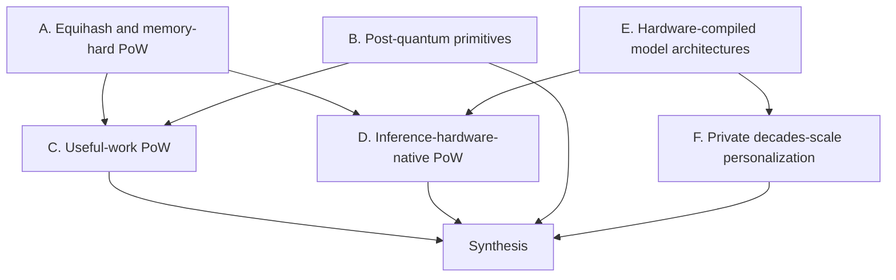
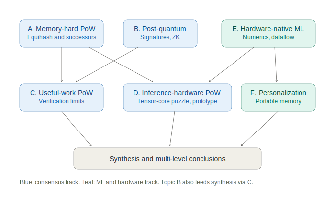

# FableFrontiers.md — Research Program Plan

This document is the plan, method, and presentation structure for a six-topic research program spanning memory-hard proof-of-work, post-quantum cryptocurrency primitives, useful-work consensus, inference-hardware-native algorithms, hardware-compiled model architectures, and decades-scale private personalization. It defines how findings will be gathered, graded, presented, and concluded at three levels from macro judgment to immediately actionable work items. The intended reader is a business-savvy, financially competent scientist and experienced software engineer; the document introduces terminology once, links primary sources inline, and specifies the visualization devices each findings document will use.

## Table of Contents

1. [Purpose and Audience](#1-purpose-and-audience)
2. [Topic Map](#2-topic-map)
3. [Terminology Primer](#3-terminology-primer)
4. [Method](#4-method)
5. [Presentation Structure](#5-presentation-structure)
6. [Conclusion Levels](#6-conclusion-levels)
7. [Further Directions Taxonomy](#7-further-directions-taxonomy)
8. [Visualization Devices](#8-visualization-devices)
9. [Topic Briefs](#9-topic-briefs)
10. [Sequencing and Deliverables](#10-sequencing-and-deliverables)

## 1. Purpose and Audience

The six questions share a single underlying tension: cryptographic and consensus algorithms are designed to waste resources verifiably, while machine-learning systems are designed to spend the same resources productively — and both are converging on the same hardware. The program's purpose is to map where these fields already touch, where the touch points are exploitable, and what is worth building.

The reader is assumed to know what a hash function, a GPU, and a balance sheet are, but not the internals of Wagner's algorithm or lattice cryptography. Accordingly, every findings document opens with a lead-in that states the problem in one paragraph before any formalism, terminology is defined exactly once in the primer of Section 3 and reused by reference, and every quantitative claim carries an inline link to its source plus an evidence grade per Section 4. Business framing is not segregated into an appendix; cost, market, and adoption implications appear inline where the technical fact that drives them appears.

## 2. Topic Map

The topics are not six independent surveys; they form a dependency structure, and the presentation order exploits it to avoid re-explaining shared machinery. Topic A builds the cost-model vocabulary that C and D consume. Topic B is largely independent but shares the verifiability toolkit with C. Topic E supplies the hardware-architecture analysis that D targets from the consensus side and F targets from the personalization side.

The same map is available as a standalone rendering in [FableFrontiers.svg](FableFrontiers.svg) for contexts where mermaid does not render.

Reading paths differ by interest. The consensus-economics path is A, C, D, Synthesis. The cryptography path is B, C, Synthesis. The hardware and ML-systems path is E, D, F, Synthesis. Each findings document states its prerequisites in one line at the top so a reader entering mid-path knows what to backfill.

## 3. Terminology Primer

Terms below are defined here once; findings documents use them without redefinition and link back to this section. The primer is ordered by topic cluster rather than alphabetically so it can be read as a five-minute orientation.

**Proof-of-work and memory hardness.** *PoW* is a puzzle whose solution is expensive to find and cheap to verify, used to rate-limit block production. *Memory-hard* functions force the solver to hold or stream a large working set, on the theory that DRAM cost and bandwidth are more egalitarian across hardware classes than logic. The distinction that matters in practice is *capacity-hard* (you must hold N bytes; [Equihash](https://eprint.iacr.org/2015/946), [Cuckoo Cycle](https://github.com/tromp/cuckoo)) versus *bandwidth-hard* (you must move bytes at rate B; [Ethash](https://ethereum.org/en/developers/docs/consensus-mechanisms/pow/mining-algorithms/ethash/), [Autolykos](https://github.com/ergoplatform/Autolykos)). *TMTO*, time–memory trade-off, is the attack that converts capacity into recomputation; a memory-hard design is judged by the steepness of its TMTO penalty curve. *ASIC resistance* is the design goal that custom silicon should offer no large advantage over commodity hardware; the historical record, covered in Topic A, is that it degrades to *ASIC delay*. *Wagner's algorithm* solves the [generalized birthday problem](https://people.eecs.berkeley.edu/~daw/papers/genbday.html) — find k hashes XOR-summing to zero — in the k-tree time/memory profile that Equihash inherits as its solver core. *Amortization resistance* means one solve attempt cannot subsidize the next; *progress-freeness* means a solver twice as far into an attempt has no more than proportional advantage, which keeps small miners viable.

**Post-quantum.** *PQC*, post-quantum cryptography, covers primitives believed secure against quantum adversaries. [Shor's algorithm](https://en.wikipedia.org/wiki/Shor%27s_algorithm) breaks the elliptic-curve signatures securing essentially all current cryptocurrency balances; [Grover's algorithm](https://en.wikipedia.org/wiki/Grover%27s_algorithm) gives only a quadratic speedup against hash-based PoW, which is why mining is the least quantum-exposed part of a chain. The NIST-standardized families are lattice-based [ML-KEM](https://csrc.nist.gov/pubs/fips/203/final) and [ML-DSA](https://csrc.nist.gov/pubs/fips/204/final), and hash-based [SLH-DSA](https://csrc.nist.gov/pubs/fips/205/final) derived from [SPHINCS+](https://sphincs.org). *SNARK* and *STARK* are succinct proof systems; STARKs matter here because their [FRI-based construction](https://eprint.iacr.org/2018/046) relies only on hash functions and is therefore plausibly post-quantum, unlike pairing-based SNARKs or the discrete-log-based [Halo 2](https://github.com/zcash/halo2) that Zcash currently deploys. A *VDF*, verifiable delay function ([Wesolowski](https://eprint.iacr.org/2018/623)), forces sequential time and appears in both PQ consensus and useful-work discussions.

**Useful work.** *PoUW*, proof of useful work, replaces the wasted puzzle with computation someone values, and its central obstacle is captured by the *verifier's dilemma*: verification must stay orders of magnitude cheaper than the work itself, must not be gameable by the party choosing the work, and the work supply must be permissionless and uniform. *Proof of space* ([Chia](https://docs.chia.net/proof-of-space/)) wastes storage instead of energy and is the most successful deployed sibling.

**Inference hardware and numerics.** *Arithmetic intensity* is FLOPs per byte moved; the *roofline model* plots achievable throughput against it and is the single most useful device for judging whether an algorithm fits a given chip. *W4A16* notation means 4-bit weights, 16-bit activations. *LNS*, log-number-system, replaces multiplication with addition at the cost of awkward addition. *Ternary* or 1.58-bit weights take values in {-1, 0, +1}, making matrix multiply a sign-controlled accumulate — the [BitNet b1.58](https://arxiv.org/abs/2402.17764) result. [Microscaling formats](https://arxiv.org/abs/2310.10537) attach shared exponents to small blocks of low-bit values and are now in shipping silicon. *PIM/CIM*, processing-in-memory and compute-in-memory, place arithmetic inside or beside the memory arrays; *dataflow architectures* ([Groq](https://groq.com), [Cerebras](https://www.cerebras.ai)) schedule the whole model spatially at compile time instead of dynamically through cache hierarchies.

**Personalization.** *PEFT*, parameter-efficient fine-tuning, covers [LoRA](https://arxiv.org/abs/2106.09685) low-rank adapters, [prefix tuning](https://arxiv.org/abs/2101.00190), and relatives that train small deltas against frozen weights. *Model editing* ([ROME](https://arxiv.org/abs/2202.05262), [MEMIT](https://arxiv.org/abs/2210.07229)) surgically rewrites specific facts in weights. *RAG*, retrieval-augmented generation, injects external memory at inference time. *Test-time training* ([TTT](https://arxiv.org/abs/2407.04620)) makes the hidden state itself a small model updated by gradient steps during inference. *DP*, differential privacy ([DP-SGD](https://arxiv.org/abs/1607.00133)), and [federated learning](https://arxiv.org/abs/1602.05629) are the standard privacy tools whose limits Topic F probes.

## 4. Method

The method is the same five-stage pipeline for every topic, with topic-specific depth noted in the briefs of Section 9. The stages are ordered so that cheap desk work filters what earns expensive prototype work.

**Stage 1, literature and artifact survey.** Sources are tiered: peer-reviewed and [IACR eprint](https://eprint.iacr.org) papers first, then project whitepapers and specifications, then production source code, then named individual technical voices — mailing-list positions, practitioner blogs, published dissents — treated as first-class evidence when the author and the specific claim are identifiable, feeding the voices-and-dissent section of each findings document. Anonymous forum material is used only for historical color or performance folklore, always labeled as such. Every source gets an inline link at point of use — no bibliography-only citations, because the reader should be one click from verification.

**Stage 2, implementation study.** For topics with living code, read and where practical build and profile the reference implementations named in Section 9: solver hot loops, memory layouts, kernel launch structure, and the gap between paper claims and shipped code. Profiling runs happen on locally available hardware, and results state the exact hardware and toolchain versions.

**Stage 3, modeling.** Construct explicit cost models — joules and dollars per solve, bytes moved per attempt, TMTO penalty curves, verification-to-work cost ratios — and put them in small reproducible scripts committed alongside the findings so the reader can vary assumptions. A model with hidden constants is treated as rhetoric, not evidence.

**Stage 4, prototyping.** One to two prototypes for the whole program, selected at the Stage 3 gate by expected information value, not by topic quota. Candidates are pre-identified in Section 9. Prototypes live in their own subdirectories with build instructions and benchmark harnesses.

**Stage 5, synthesis.** Cross-topic conclusions drawn only after per-topic findings are graded, following the structure in Sections 5 and 6.

Every factual claim in a findings document carries one of four evidence grades, stated inline in brackets. *Measured*: we ran it and the harness is committed. *Reported*: a linked source measured it and the conditions are quoted. *Modeled*: derived from our committed cost model. *Speculative*: labeled reasoning, no number attached. Grades exist to keep the financially competent reader from pricing a speculation as a measurement.

## 5. Presentation Structure

Findings are presented as one document per topic plus one synthesis document, all following a fixed template so a reader can navigate any of them after learning one. Uniformity is what makes the redundancy minimization work: shared material lives in exactly one place — terminology in this document's Section 3, cost models in the topic that introduced them — and is referenced by document and section, never restated.

Each topic document has seven fixed sections. First, a lead-in stating the problem, why it matters now, and the one-line prerequisite pointer. Second, state of the art: an annotated timeline of the field and a comparison table of live candidates with exact parameters. Third, analysis: the cost models, bottleneck arguments, and profiling results, with every number graded. Fourth, voices and dissent: named individual positions with their specific arguments — practitioners, skeptics, and critics of the approaches and timelines — kept separate from the institutional record because the disagreement pattern is itself evidence, and because official sources systematically understate error bars. Fifth, findings: numbered items with stable identifiers — F-A1, F-A2 for Topic A — so the synthesis and future documents can cite them precisely. Sixth, conclusions at the three levels defined in Section 6. Seventh, further directions sorted by the taxonomy of Section 7.

Two structural rules apply throughout. Every section opens with a lead-in sentence before any table or list. Findings identifiers are permanent: a finding later invalidated is marked superseded in place rather than deleted, so cross-references never dangle.

## 6. Conclusion Levels

Conclusions are stratified into three levels because the intended reader acts on different time horizons with different instruments — capital allocation, architecture decisions, and next-week engineering work — and a single undifferentiated "conclusions" section serves none of them.

**Level 1, macro.** Field-level judgments defensible to a skeptical outsider: whether memory-hard PoW is a solved problem in slow decline or a dormant one awaiting a hardware shift; whether the quantum threat timeline justifies present-day migration cost for any chain; whether PoUW is structurally impossible at scale or merely unsolved. Each macro conclusion states what evidence would reverse it.

**Level 2, strategic.** Per-topic positioning calls: build, watch, or ignore for each candidate mechanism; which hardware trend lines matter and which are noise; where a small team has an edge over incumbents. These cite finding identifiers directly.

**Level 3, immediately actionable.** Concrete items executable now: a specific repository to fork and a specific kernel to rewrite, a parameter set to benchmark, a paper result to replicate, an eprint to monitor. Each item names its expected artifact so completion is checkable.

## 7. Further Directions Taxonomy

Directions that survive the findings but exceed the program's scope are recorded under four headings, kept separate because their audiences and funding instruments differ.

*Science*: open problems needing new theory — e.g., a memory-hard function with a proven TMTO lower bound under realistic memory models (partially delivered since this plan was written: the pebbling-based construction (eprint 2025/1456) noted in Section 9.1), or PQ recursive proof composition with practical constants. *Engineering*: work needing no new ideas, only execution — ports, kernels, benchmark suites, audits. *Business*: markets, cost structures, and monetization surfaces the findings expose, priced where the models allow. *Social*: energy, decentralization, privacy, and regulatory consequences, argued from the findings rather than from sentiment.

## 8. Visualization Devices

Each device below is chosen for a specific recurring explanatory job, and findings documents use them by this catalog rather than improvising per document.

| Device | Job | Rendering |
|---|---|---|
| Mermaid dependency and pipeline diagrams | Algorithm stage flows, topic interlocks, migration sequences | In-repo markdown, renders on GitHub |
| Comparison tables with exact parameters | Candidate algorithms, hardware targets, format trade-offs | In-repo markdown |
| Roofline plots | Whether an algorithm is compute- or bandwidth-bound on a named chip | SVG committed under `papers/`, generated by committed scripts |
| TMTO and cost curves | Memory-hardness quality, solver economics | SVG under `papers/`, generated by committed scripts |
| ASCII memory-layout diagrams | Data-structure and bucket layouts in solver hot paths | In-repo markdown code blocks |
| Timeline tables | Field history, PQ migration windows | In-repo markdown |
| Decision matrices | Level 2 build/watch/ignore calls, with the scoring rubric printed above the matrix | In-repo markdown |

Interactive widgets are used in working sessions for exploration but every load-bearing visual is committed to the repository in a form that renders without a live session, because the findings documents must stand alone.

## 9. Topic Briefs

Each brief fixes the topic's scope boundary, the primary sources and code to study, the analysis specific to that topic, the pre-identified prototype candidate for the Stage 4 gate, and the known risks to the topic's conclusions.

### 9.1 Topic A: Equihash and Memory-Hard PoW

Scope: the [Equihash](https://eprint.iacr.org/2015/946) design and its solver history as the anchor case, generalized to the memory-hard PoW design space and what a 2026-era redesign would change. The core questions are why the 2016–2017 optimization wave ([Zcash open source miner challenge](https://github.com/zcash/zcash/issues/1338), tromp's [equihash solvers](https://github.com/tromp/equihash), [nheqminer](https://github.com/nicehash/nheqminer)) plateaued, why ASIC resistance failed — Bitmain shipped Equihash ASICs against the (200,9) parameter set within two years, and Zcash's [parameter choice discussion](https://zips.z.cash/protocol/protocol.pdf) never moved to the harder (144,5) family that [Bitcoin Gold adopted](https://github.com/BTCGPU/BTCGPU) — and which of today's alternatives actually improved on it: [RandomX](https://github.com/tevador/RandomX)'s CPU-favoring random program execution, [Cuckoo Cycle](https://github.com/tromp/cuckoo)'s graph-cycle capacity hardness as deployed by [Grin](https://github.com/mimblewimble/grin), Autolykos's bandwidth hardness, and Kaspa's [kHeavyHash](https://github.com/kaspanet/rusty-kaspa) matrix variant descending from [optical PoW](https://arxiv.org/abs/1911.05193). Analysis centers on sorting-network versus bucket-sort solver structure for Wagner's k-tree, the actual TMTO curves versus the paper's claims, and a cost model in dollars per solve across CPU, consumer GPU, datacenter GPU, and hypothetical ASIC. Prototype candidate: a modernized Equihash solver kernel exploiting post-2017 GPU features — asynchronous bulk copies, tensor-core-adjacent integer paths, the large shared-memory carveouts of current architectures — to measure how much headroom the 2017 plateau left. Risk: mining economics data is noisy and vendor claims dominate the public record, so the cost model must be built from first principles with hardware datasheets. Status note: two 2025 results anchor the Stage 1 survey ahead of execution. A [provably memory-hard PoW construction](https://eprint.iacr.org/2025/1456) (Blocki-Smearsoll, eprint 2025/1456) gives generic pebbling-based lower bounds on prover memory cost. And Tang–Sun–Gong, "[On the Regularity of the Generalized Birthday Problem](https://eprint.iacr.org/2025/1351)" (read in full from the primary source), settles the questions this brief poses: Equihash rests on a tree-binding non-regular single-list GBP whose memory hardness reduces to the self-merge problem; the index-pointer technique plus off-chip memory (Bai et al., NDSS 2019) already collapsed deployed ASIC resistance — Zcash's (200,9) peak memory is roughly 49 MB under modern solvers; valid parameters require k at most sqrt(n/2+1), invalidating sets like (192,11); and their Requihash variant restores regularity via sequential constraints, raising (200,9)-class peak memory to roughly 223 MB with a client-side-only change. The survey's open-problem framing shifts from conjectured to provable memory hardness, and the 2017 plateau question is substantially answered before Stage 2 begins. Delivered as [Equihash.md](Equihash.md) with findings F-A1 through F-A9; the prototype candidate above is superseded per F-A5 — the informative measurements are now the 2025 estimators against deployed parameters and a Requihash-versus-Equihash benchmark.

### 9.2 Topic B: Post-Quantum Cryptocurrency Primitives

Scope: quantum exposure and migration options across the three cryptographic layers of a chain — signatures, PoW, and zero-knowledge circuits — from deployed systems to distant directions. The exposure hierarchy is settled in outline ([Aggarwal et al.](https://arxiv.org/abs/1710.10377)): Shor breaks ECDSA and EdDSA account security outright, Grover only halves effective PoW security, and pairing-based SNARK setups break while [FRI-based STARKs](https://eprint.iacr.org/2018/046) survive. The interesting work is in the migration mechanics and constants: signature size blowup — ML-DSA at roughly 3.3 KB and SLH-DSA at 8–50 KB per signature against 64–72 bytes today — versus block space and fee markets; hash-based one-time-signature chains ([XMSS, RFC 8391](https://www.rfc-editor.org/rfc/rfc8391)) as deployed by [QRL](https://github.com/theQRL/QRL); Zcash's specific dilemma of migrating [Halo 2](https://github.com/zcash/halo2) commitments off discrete-log assumptions; and the state of hash-based proving stacks ([Plonky3](https://github.com/Plonky3/Plonky3), [RISC Zero](https://github.com/risc0/risc0), [Stwo](https://github.com/starkware-libs/stwo)) as the practical PQ-ZK path. Analysis: a migration-window model comparing credible quantum-hardware timelines against chain governance latency, and a per-transaction byte and verification-cost table across signature families. No prototype is planned; this topic is survey and modeling. Risk: quantum timeline estimates are the field's softest input, so all conclusions are expressed as conditionals on capability milestones rather than dates. Status note: delivered as [PostQuantum.md](PostQuantum.md) with findings F-B1 through F-B12; the survey found the field had moved from standards to deployment, and the timeline-conditional framing is retained in its Section 6 conclusions.

### 9.3 Topic C: Useful Work Under PoW Constraints

Scope: the space between pure waste and pure utility, mapped against the hard requirements a PoW substitute must keep — cheap verification, permissionless work supply, amortization resistance, progress-freeness — which most "mine by doing science" proposals fail. The survey spans the deployed and the theoretical: [Primecoin](https://github.com/primecoin/primecoin)'s prime chains as the honest early attempt whose work was mathematically real but economically useless; [Gridcoin](https://gridcoin.us)'s BOINC subsidy model, which is payment-for-work rather than PoW; [Chia](https://docs.chia.net/proof-of-space/)'s proof of space as the successful reframing that wastes a cheaper resource instead; the theory line of [Ball–Rosen–Sabin–Vasudevan](https://eprint.iacr.org/2017/203) building PoW from worst-case fine-grained problems like orthogonal vectors, and [Ofelimos](https://eprint.iacr.org/2021/1379) wrapping stochastic combinatorial optimization in a doubly-efficient interactive proof; and the ML-flavored line — [Proof-of-Learning](https://arxiv.org/abs/2103.05633) and its known verification attacks, [Bittensor](https://github.com/opentensor/bittensor)'s consensus-by-peer-scoring, and [Gensyn](https://www.gensyn.ai)'s verifiable-training market — where the recurring failure is that verification either costs too much or is gameable by the work submitter. Analysis: a requirements matrix scoring each candidate against the PoW constraint set, and a verification-cost-ratio model identifying which useful-computation classes could ever clear the bar. Prototype candidate: none standalone; Topic C feeds constraints into the Topic D prototype. Risk: the space attracts motivated reasoning and token marketing, so the matrix scores only from primary technical documents.

### 9.4 Topic D: PoW and Consensus Algorithms for Inference Hardware

Scope: the deliberate inversion of ASIC resistance — design the puzzle so that the optimal solver *is* inference hardware, on the argument that commodity-anchoring to the largest hardware fleet on earth is the modern successor to CPU-anchoring, and idle inference capacity gets a monetization floor. Prior art is thin, which is the opportunity: Bytom's [Tensority](https://github.com/Bytom/bytom) put tensor operations in a PoW in 2018 before the hardware mattered; kHeavyHash's small matrix multiply is a gesture in this direction; nothing deployed targets tensor cores, transformer engines, or high-bandwidth memory specifically. Design questions: a puzzle whose inner loop is low-precision matrix multiplication with verifiability coming from Freivalds-style randomized checking, whose parameters track the microscaling formats of Section 3 so the puzzle ages with the hardware rather than against it; whether deterministic integer tensor paths exist across vendors, since floating-point non-determinism breaks consensus; and how to keep the puzzle progress-free when the natural workload is batched. The same analysis extends past GPUs to the dataflow and PIM architectures surveyed in Topic E, asking which puzzle shapes each one would dominate. Prototype candidate: a tensor-core PoW microbenchmark — INT8/FP8 matrix-multiply puzzle core plus Freivalds verifier — measuring solve/verify asymmetry and cross-vendor determinism on available hardware; this is the leading Stage 4 candidate for the whole program. Risk: consensus-grade determinism on tensor units is an empirical unknown that could invalidate the design class, which is exactly why it is measured first. Status note: the Topic D findings ([InferencePoW.md](InferencePoW.md), F-D1 and F-D7) partially supersede this brief — a deployed system (Pearl/cuPOW, April 2026) now anchors the survey, the determinism question is substantially answered from literature, and the prototype target has pivoted to reproducing the cuPOW overhead claim plus a cross-vendor INT8 bit-exactness sweep.

### 9.5 Topic E: Hardware-Compiled Model Architectures

Scope: model-architecture and data-structure choices that render naturally into fixed hardware blocks with embedded memory and cheap numerics, on the premise stated in the task — cache-hierarchy-and-coherent-bus machines were tuned for enterprise loads, not attention, and 32-bit float is already unnecessary. The survey covers the numerics axis — ternary weights per [BitNet b1.58](https://arxiv.org/abs/2402.17764) where multiply becomes sign-select-accumulate, [log-number-system](https://en.wikipedia.org/wiki/Logarithmic_number_system) arithmetic where multiply becomes add, [posits](https://posithub.org), block [microscaling formats](https://arxiv.org/abs/2310.10537), and structured sparsity as a first-class representation rather than a pruning afterthought — and the architecture axis: [Mamba](https://arxiv.org/abs/2312.00752)-family state-space models whose fixed-size recurrent state suits embedded SRAM the way attention's growing KV cache does not; [FlashAttention](https://arxiv.org/abs/2205.14135) read as evidence that attention was always a memory-layout problem; and the deployed counterexamples to the cache-hierarchy consensus, [Groq](https://groq.com)'s compile-time-scheduled SRAM dataflow and [Cerebras](https://www.cerebras.ai)'s wafer-scale distributed memory. The synthesis question is which model families become *compilable to silicon* — weights baked into ROM or CIM arrays, no DRAM in the inner loop — and what co-designed representation (ternary LNS, signed-zero exploitation, pruning encoded structurally) maximizes what fits. Analysis: roofline and bytes-per-token models for representative blocks across the candidate representations. Prototype candidate: a ternary or LNS matrix kernel with a bytes-per-token comparison against an FP8 baseline, secondary priority behind the Topic D prototype. Risk: vendor performance claims in this space are aggressive; only reproducible numbers enter the findings. Status note: [HardwareBridge.md](HardwareBridge.md) Section 5 sharpens this brief ahead of execution — the numerics axis must additionally preserve the finite-field mapping of F-X1, and static-scheduling determinism (F-X3) joins bytes-per-token as an evaluation criterion.

### 9.6 Topic F: Private Decades-Scale Personalization

Scope: personalization that compounds over decades and survives frontier-model turnover measured in months, seeking structure beyond the default answer of accumulating personal data for retrieval. The frame is a portability boundary: anything expressed in tokens or explicit structure — RAG stores, [MemGPT](https://arxiv.org/abs/2310.08560)-style memory hierarchies, knowledge graphs, constitutions and steering documents — ports across model generations trivially; anything expressed in weights — [LoRA](https://arxiv.org/abs/2106.09685) adapters, [ROME](https://arxiv.org/abs/2202.05262)/[MEMIT](https://arxiv.org/abs/2210.07229) edits — is stranded when the base model is retired, which the task correctly identifies as the impracticality of direct weight manipulation. The survey targets the middle ground where the strong algo-plus-structure answer must live: compiling accumulated personal corpus into reusable inference-time state such as trained KV-cache artifacts ([Cartridges](https://arxiv.org/abs/2506.06266)); [test-time training](https://arxiv.org/abs/2407.04620) as ephemeral per-session weights that are regenerated rather than maintained; hypernetwork-style generators that re-derive a personal adapter from the durable corpus against each new base model, making the *derivation procedure* the persistent asset rather than the weights; and the privacy substrate — local fine-tuning economics via [QLoRA](https://arxiv.org/abs/2305.14314), [DP-SGD](https://arxiv.org/abs/1607.00133) noise costs at individual scale, [federated](https://arxiv.org/abs/1602.05629) aggregation's irrelevance to an audience of one. This topic connects to Topic E: a lifetime personal model is the natural tenant of the embedded-memory hardware blocks surveyed there. Analysis: a durability-versus-depth matrix placing each mechanism by personalization strength against survival across model generations, plus a threat model for what private means over a multi-decade horizon including inference attacks on adapters. Prototype candidate: none in this program; the actionable output is an architecture proposal with the matrix as its evidence base. Risk: the field moves fast enough that findings must separate mechanism-level conclusions, which age slowly, from system-level ones, which age in months.

## 10. Sequencing and Deliverables

Execution order follows the dependency structure of Section 2: A first because its cost-model vocabulary is load-bearing for C and D; B and E in parallel as independent surveys; C after A and B since it consumes both; D after A, C, and E as the program's convergence point and prototype host; F after E; synthesis last. The Stage 4 prototype gate sits after D's Stage 3 modeling, with the tensor-core PoW microbenchmark of Section 9.4 as the leading candidate and the Section 9.1 Equihash kernel and Section 9.5 ternary kernel as alternates.

Deliverables are one findings document per topic plus the synthesis, committed to this repository, with generated figures under `papers/` and prototype code in dedicated subdirectories. The planned files are [Equihash.md](Equihash.md) for Topic A (delivered, findings F-A1 through F-A9), [PostQuantum.md](PostQuantum.md) for B (delivered, findings F-B1 through F-B12), `UsefulWork.md` for C, [InferencePoW.md](InferencePoW.md) for D (delivered, findings F-D1 through F-D11), `HardwareNative.md` for E, `Personalization.md` for F, and `Synthesis.md` for the cross-topic conclusions and the consolidated Level 1 through Level 3 conclusion set. One unplanned document class exists: [HardwareBridge.md](HardwareBridge.md) is a cross-topic bridge note connecting the delivered B and D findings to hardware design, carrying F-X identifiers that the synthesis cites alongside per-topic findings; bridge notes use a shortened template and do not replace topic documents. Each document follows the Section 5 template, grades evidence per Section 4, and draws its visuals from the Section 8 catalog.
