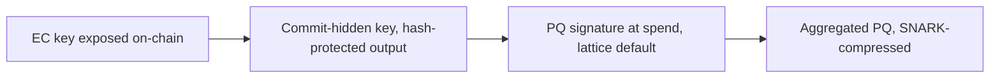

# PostQuantum.md — Topic B Findings: Post-Quantum Cryptocurrency Primitives

Prerequisites: the post-quantum and proof-of-work clusters of the [FableFrontiers.md](FableFrontiers.md) Section 3 terminology primer. This document covers the quantum exposure of cryptocurrency systems across their three cryptographic layers — signatures, proof-of-work, and zero-knowledge circuits — and the migration mechanics now underway, following the template of FableFrontiers.md Section 5 with evidence grades per FableFrontiers.md Section 4.

## Table of Contents

1. [Scope and Stakes](#1-scope-and-stakes)
2. [State of the Art](#2-state-of-the-art)
3. [Analysis](#3-analysis)
4. [Voices and Dissent](#4-voices-and-dissent)
5. [Findings](#5-findings)
6. [Conclusions](#6-conclusions)
7. [Further Directions](#7-further-directions)

## 1. Scope and Stakes

The question this document answers is not whether quantum computers threaten cryptocurrencies — the exposure hierarchy has been settled in outline since [Aggarwal et al. 2017](https://arxiv.org/abs/1710.10377) — but what the migration actually costs, which mechanisms the major chains have now committed to, and where the remaining open problems sit. The stakes concentrate in one asymmetry: Shor's algorithm breaks elliptic-curve account security outright, while Grover's algorithm only halves effective hash security, so the balances are exposed long before the mining is. Roughly a quarter of the Bitcoin supply sits in outputs with already-revealed public keys — early pay-to-public-key coins and reused addresses — and much of it is lost coinage that no owner can migrate [Reported: [Chaincode Labs survey](https://chaincode.com/bitcoin-post-quantum.pdf)]. The migration problem is therefore three problems: a cryptographic substitution, a block-space economics problem created by signature size, and a social-consensus problem about coins that cannot move themselves.

What changed recently, and why this document exists now: between mid-2024 and mid-2026 the field moved from standards-writing to deployment. NIST finalized its first three standards, Bitcoin merged its first quantum-resistant address-type proposal, the Ethereum Foundation elevated post-quantum security to a top strategic priority, and Zcash published a dated migration roadmap. The survey below is organized around that shift.

## 2. State of the Art

The timeline shows a field that compressed a decade of anticipated schedule into about two years, driven by error-correction results on the hardware side and standards finalization on the cryptography side.

| Date | Event | Layer |
|---|---|---|
| Aug 2024 | NIST finalizes [FIPS 203 ML-KEM](https://csrc.nist.gov/pubs/fips/203/final), [FIPS 204 ML-DSA](https://csrc.nist.gov/pubs/fips/204/final), [FIPS 205 SLH-DSA](https://csrc.nist.gov/pubs/fips/205/final) | Standards |
| Dec 2024 | Google [Willow](https://quantumzeitgeist.com/google-quantum-computing/) demonstrates below-threshold surface-code error correction | Hardware |
| Mar 2025 | NIST selects [HQC](https://industrialcyber.co/nist/nist-advances-post-quantum-cryptography-standardization-selects-hqc-algorithm-to-counter-quantum-threats/) as backup KEM; [FN-DSA](https://en.wikipedia.org/wiki/NIST_Post-Quantum_Cryptography_Standardization) draft still pending | Standards |
| Nov 2025 | Scott Aaronson, long the field's calibrating skeptic, writes that a fault-tolerant machine running Shor's algorithm "before the next US presidential election" is now [a live possibility](https://scottaaronson.blog/?p=9425) | Hardware |
| Jan 2026 | Ethereum Foundation [declares PQ security a top strategic priority](https://thequantuminsider.com/2026/01/26/ethereum-foundation-elevates-post-quantum-security-to-top-strategic-priority/); [$1M Poseidon Prize](https://www.theblock.co/post/386938/ethereum-foundation-forms-post-quantum-security-team-adds-1-million-research-prize) | Signatures, ZK |
| Feb 2026 | [BIP-360](https://bip360.org/bip360.html) merged into the Bitcoin BIPs repository: Pay-to-Merkle-Root outputs, `bc1r` prefix | Signatures |
| Mar 2026 | Google Quantum AI estimate: roughly 1,200 logical qubits to break 256-bit elliptic-curve keys; Google's "[Quantum Frontiers may be closer than they appear](https://www.mindstudio.ai/blog/scott-aaronson-2029-warning-quantum-skeptic-sounding-alarm)" sets an internal 2029 deadline to migrate its own infrastructure to PQC, citing falling qubit estimates for RSA [Reported] | Hardware |
| Apr 2026 | [BIP-361](https://github.com/bitcoin/bips/blob/master/bip-0361.mediawiki) published: structured sunset of legacy signature types | Signatures |
| Apr–May 2026 | Zcash publishes [post-quantum roadmap](https://www.coindesk.com/tech/2026/05/08/zcash-to-roll-out-quantum-recoverable-wallets-within-a-month-go-quantum-proof-by-2027): quantum-recoverable wallets June 2026, full PQ by 2027 | Signatures, ZK |

The signature families now in play differ by an order of magnitude in size, and size — not verification speed — is what a blockchain buys with its scarcest resource. The comparison below uses NIST security level 1–2 parameter sets, the relevant tier for per-transaction signatures [Reported: parameter sizes from the FIPS specifications linked above].

| Scheme | Assumption | Signature bytes | Public key bytes | Blockchain-relevant property |
|---|---|---|---|---|
| Schnorr [BIP-340](https://github.com/bitcoin/bips/blob/master/bip-0340.mediawiki), current | Elliptic-curve discrete log | 64 | 32 | Baseline; broken by Shor |
| ML-DSA-44, FIPS 204 | Module lattices | 2,420 | 1,312 | Fast verify; the default substitution |
| Falcon-512 / FN-DSA draft | NTRU lattices | ~666 | 897 | Smallest lattice signatures; floating-point signing risk, standard unfinished |
| SLH-DSA-128s, FIPS 205 | Hash functions only | 7,856 | 32 | Most conservative assumption; largest signatures |
| XMSS [RFC 8391](https://www.rfc-editor.org/rfc/rfc8391) | Hash functions, stateful | ~2,500 | ~60 | Deployed by [QRL](https://github.com/theQRL/QRL) since 2018; state management is the operational hazard |

Chain-by-chain, three distinct migration architectures have emerged, and they differ in which layer carries the post-quantum burden: Bitcoin moves it into the output type, Ethereum into an aggregation proof, Zcash into the note commitment scheme.

Bitcoin's [BIP-360](https://bip360.org/bip360.html) Pay-to-Merkle-Root removes the vulnerable key-path spend entirely — the output commits only to a script-tree Merkle root, no public key appears on-chain at creation, and ML-DSA opcodes handle post-quantum spending. A functional testnet with full P2MR consensus validation — [BTQ Technologies' Bitcoin Quantum](https://bitcoinquantum.com/testnet), open source at [btq-ag/btq-core](https://github.com/btq-ag/btq-core/releases/tag/v0.3.0-testnet), with SegWit version 2 outputs, five ML-DSA tapscript opcodes, and CLI wallet tooling — ran over 100,000 blocks with more than 50 miners by March 2026 [Reported: [The Quantum Insider](https://thequantuminsider.com/2026/03/20/btq-technologies-implements-bip-360-quantum-resistant-bitcoin-transactions-testnet/)].

Ethereum's [lean roadmap](https://leanroadmap.org/) pairs a hash-based validator signature scheme, leanXMSS, with a minimal zkVM, leanVM, that aggregates signatures by proving them — compressing roughly 3,000-byte hash-based signatures against the 96-byte BLS baseline by a claimed 250x at the aggregate level, with over ten client teams in interoperability testing [Reported: [pq.ethereum.org](https://pq.ethereum.org/), [hash-based multi-signatures paper](https://eprint.iacr.org/2025/055.pdf)].

Zcash faces the hardest problem — its entire value proposition runs through [Halo 2](https://github.com/zcash/halo2), whose inner-product commitments rest on elliptic-curve discrete log — and has committed to quantum-recoverable wallets as a transitional idiom in June 2026 with a full protocol replacement targeted for 2027. The concrete mechanism is [ZIP 2005, Ironwood Quantum Recoverability](https://zips.z.cash/zip-2005), activated on the NU7 testnet May 22, 2026 alongside the Tachyon groundwork [Reported: [CoinDesk](https://www.coindesk.com/tech/2026/05/08/zcash-to-roll-out-quantum-recoverable-wallets-within-a-month-go-quantum-proof-by-2027), [ZecHub](https://zechub.substack.com/p/zcash-shielded-news-vol18-128)].

On the zero-knowledge layer, the hash-based proving stacks — [Stwo](https://github.com/starkware-libs/stwo)'s circle STARKs, [Plonky3](https://github.com/Plonky3/Plonky3), [RISC Zero](https://github.com/risc0/risc0) — are plausibly post-quantum in production today, with soundness reducing to FRI and hash collision resistance. The research frontier is lattice-based succinctness: [Greyhound](https://blog.zksecurity.xyz/posts/greyhound/) as the first plausibly practical lattice polynomial commitment, and the 2025 folding-scheme line of LatticeFold+ and Neo, which target the smaller proofs and better recursion that hash-based systems give up [Reported].

## 3. Analysis

The binding constraint for UTXO chains is witness bytes, and the arithmetic is unforgiving. A current Bitcoin single-signature input carries roughly 105 witness bytes (64-byte Schnorr signature plus 32-byte key plus overhead); the same input under ML-DSA-44 carries roughly 3,730 bytes of signature and public key — a factor of about 35 [Modeled: parameter sizes above, standard witness accounting]. Held at today's 4M weight-unit blocks, a fully post-quantum Bitcoin without aggregation carries on the order of 30x fewer signature inputs per block, which either collapses throughput or multiplies fees by the same factor. This is why the aggregation question is not an optimization but the load-bearing design decision: Ethereum answered it with SNARK aggregation of hash-based signatures, and Bitcoin has not yet answered it — BIP-360 makes outputs quantum-resistant without making them compact. SLH-DSA at 7,856 bytes roughly doubles the lattice penalty again, which is the quantitative reason every chain's default is lattice signatures with hash-based schemes reserved for the assumption-conservative tail.

The migration-window model is expressed in milestones, not dates, per the Topic B risk note in FableFrontiers.md Section 9.2. The chain of conditions for an actual key-recovery attack: below-threshold error correction (demonstrated December 2024), an error-corrected logical module (IBM's Kookaburra target, 2026), on the order of 1,200 logical qubits with sufficient circuit depth for 256-bit elliptic-curve discrete log (the March 2026 Google estimate — a sharp reduction from the roughly 2,300 logical qubits of earlier literature, and the estimate to watch precisely because it keeps falling), and sustained gate fidelity through roughly billions of Toffoli operations [Reported across the Section 2 timeline sources; the G7 quantum roadmap's 2028 figure for RSA-2048 threat capacity is noted but graded as a policy document, not a measurement]. Against this, governance latency is measured: Bitcoin's last two soft forks each took three to four years from serious proposal to activation, and BIP-361's sunset of legacy signatures will be more contested than either because it touches unmigratable coins. The window arithmetic therefore favors exactly what is happening — commit-scheme deployment now, signature-scheme finalization later.

That two-phase structure is the pattern worth naming: hide the vulnerable key behind a hash immediately, defer the expensive post-quantum signature until spend time or until standards settle. Bitcoin's P2MR does it structurally (no key on-chain at creation), Zcash's quantum-recoverable wallets do it transitionally, and it works because hash commitments are already post-quantum. The migration flow all three chains have converged on:

The zero-knowledge layer analysis is shorter because the outcome is clearer: the elliptic-curve SNARK stack — Groth16, KZG commitments, Halo 2's inner-product argument — is the stranded asset, and hash-based FRI systems are the migration target that already exists in production. The open cost question is recursion depth: hash-based proofs are large (tens to hundreds of kilobytes) and lattice folding schemes promise smaller aggregates, but nothing lattice-based is production-deployed for succinctness yet [Reported]. Proof-of-work needs no migration at all — Grover's quadratic speedup is priced in by a difficulty adjustment, making PoW the one cryptocurrency layer that is quantum-robust by construction, an underappreciated argument in the PoW-versus-PoS debate that Topic D inherits.

## 4. Voices and Dissent

Official standards and foundation roadmaps are the consensus artifact; the individual voices are where the actual disagreements, error bars, and unpriced risks live. This section records named positions with their specific arguments, because the disagreement pattern is itself evidence — and on this topic it is unusually clean: the people closest to quantum hardware demonstrations are the most skeptical of the threat timeline, the people closest to cryptographic migration logistics are the most alarmed, and the single most informative datapoint is a career skeptic changing sides. The subsections run from most skeptical to least opinionated: hardware skeptics, the converted skeptic, the process critic, migration practitioners, primitive inventors, vendor founders, proof theorists.

### 4.1 Hardware Skeptics

The skeptics argue from demonstrated capability, not theory. [Peter Gutmann](https://www.cs.auckland.ac.nz/~pgut001/pubs/bollocks.pdf) (University of Auckland) has the sharpest version: his paper "Replication of Quantum Factorization Records with an 8-Bit Home Computer, an Abacus and a Dog" documents that no quantum computer has factored a number larger than 21 without what he calls sleight-of-hand — benchmark numbers chosen so their factors differ by only a few bits, findable by classical search, a structure real RSA moduli never have [Reported: [The Register](https://www.theregister.com/2025/07/17/quantum_cryptanalysis_criticism/)]. He regards quantum computers as physics experiments, not pending products. Within Bitcoin development the same position is held by [Peter Todd](https://murmurationstwo.substack.com/p/bitcoin-developers-are-mostly-not) — "no-one is even close to demonstrating cryptographic-relevant quantum computing," and whether quantum computers scale at all is "a genuine, fundamentally unknown question" — and by Adam Back ("probably not for 20-40 years, if then"), Luke Dashjr ("quantum isn't a real threat; Bitcoin has much bigger problems"), Mark Erhardt, and Robin Linus ("dogs are more scary than quantum computers") [Reported: murmurations survey of developer positions]. The strongest technically-grounded moderate is Pieter Wuille: "I certainly agree there is no urgency right now," with the notable inversion that the main near-term threat is *belief* in quantum computers — panic-driven migration and market dislocation — rather than the machines themselves.

### 4.2 The Converted Skeptic

The converted skeptic is the highest-information voice. Scott Aaronson spent two decades deflating quantum hype — his blog has a category effectively dedicated to it, including "[Quantum Investment Bros: Have you no shame?](https://scottaaronson.blog/?p=9344)" — which is precisely what makes his November 2025 update significant: after multiple platforms crossed fault-tolerance-threshold gate fidelities, he wrote that a Shor-capable fault-tolerant machine before the next US presidential election is "[a live possibility](https://scottaaronson.blog/?p=9425)," and by May 2026 he had co-authored a position paper on the quantum threat to cryptocurrencies with Dan Boneh and Justin Drake [Reported]. Gutmann and Aaronson do not actually disagree on the facts — nothing cryptographically relevant has been factored — they disagree on whether below-threshold error correction is the inflection that makes extrapolation legitimate. That is the entire timeline debate in one sentence, and it is not resolvable by argument, only by the next few hardware generations.

### 4.3 The Process Critic

The process critic attacks the standards, not the timeline. [Daniel J. Bernstein](https://blog.cr.yp.to/20231003-countcorrectly.html)'s sustained critique of the NIST process is orthogonal to the skeptic-believer axis and matters more for algorithm selection: his analysis of the Kyber-512 security assessment documents NIST multiplying cost terms that should have been added — "40 bits of security more than the RAM model suggests" resting on arithmetic he characterizes bluntly — plus stonewalled FOIA requests about NSA involvement in the process [Reported: [pqc-forum record](https://groups.google.com/a/list.nist.gov/g/pqc-forum/c/W2VOzy0wz_E/m/LjmQyMurBQAJ)]. The practical import for chains: lattice security margins at the smallest parameter sets are thinner and more contested than the standards' framing suggests, which is an argument for the hash-based conservative tier and for hybrid deployment. Peter Todd lands the complementary blow from the deployment side: he warns that pushing *quantum-only* algorithms — dropping the classical signature from hybrid schemes — recreates the historical NSA pattern of weakening deployed cryptography, since a hybrid requires an attacker to break both [Reported: [Traders Union coverage](https://tradersunion.com/news/market-voices/show/609190-nsa-crypto-backdoor/)].

### 4.4 Migration Practitioners

The migration practitioners argue the bottleneck is social, and they have the receipts. The [murmurations survey](https://murmurationstwo.substack.com/p/bitcoin-developers-are-mostly-not) of Bitcoin developer positions is the most useful single document on governance latency: of the influential "gatekeeper" tier, essentially none treat quantum risk as a priority, over twenty core-adjacent developers have no public position at all, and BIP-360's major update drew one mailing-list reply — its own champion, Hunter Beast, describes the reception as "total apathy" despite his own aggressive 2-to-5-year decryption estimates. The concerned minority is specific and practical: Matt Corallo argues wallets need embedded post-quantum keys roughly a decade before any credible seizure capability because key rotation propagates at wallet-software and user speed; Ethan Heilman and Jameson Lopp push proposals on similar grounds; Jonas Nick publishes the signature research. And the sharpest critique of the migration proposals themselves comes from Tadge Dryja: sunset-style plans "disable important functionality" and amount to "destroying coins preemptively" — the F-B5 problem stated as an objection rather than a finding [Reported]. On the Ethereum side the practitioner caveats are quieter but documented in the [hash-based multi-signatures paper](https://eprint.iacr.org/2025/055.pdf) itself: leanXMSS-class schemes are not a drop-in for BLS, security proofs are being rewritten in more conservative models, parameters are still moving, and SNARK aggregation exists precisely because hash-based signatures have no native aggregation — the architecture is elegant because it has to be [Reported].

### 4.5 Primitive Inventors

The inventors of the vulnerable primitives occupy a distinct position: neither skeptic nor alarmist, they argue from asymmetry of consequences. Zcash's protocol designers are the clearest case. [Daira-Emma Hopwood](https://www.youtube.com/watch?v=T2B5f297d-Y), lead author of the Zcash protocol specification, identified the precise soft spot — the Sapling and Orchard note commitment schemes are not post-quantum *binding*, so a discrete-log adversary could inflate supply invisibly — and co-authored the fix, [ZIP 2005](https://zips.z.cash/zip-2005): derive the commitment randomness from all note fields via a post-quantum hash so funds become recoverable through a special protocol if quantum capability arrives, explicitly framed as a necessary step rather than full quantum security. [Sean Bowe](https://seanbowe.com/blog/zcash-and-quantum-computers/), who built much of Zcash's proving stack, contributes the field's most useful triage rule: privacy breaks are retroactive (harvest now, decrypt later) while soundness breaks are not, so privacy hardening deserves urgency and soundness can be met reactively — his [Tachyon](https://seanbowe.com/blog/tachyon-scaling-zcash-oblivious-synchronization/) design removes in-band secret distribution to close the retroactive privacy hole, and he claims the post-Tachyon architecture reaches post-quantum soundness by swapping folding schemes, "and we have years to select the best one." Notably, Bowe also supplies the strongest *inside* critique of premature migration: oversized transactions, hardware-wallet breakage, and understudied assumptions that may be obsolete by the time they matter [Reported].

The Equihash inventors themselves complete the picture from opposite sides. Dmitry Khovratovich — co-inventor of Equihash and Argon2 — personally embodies the field's migration: now an Ethereum Foundation researcher, he is a co-author of the [hash-based multi-signatures work](https://eprint.iacr.org/2025/055.pdf) underpinning leanXMSS and of [Poseidon2](https://www.poseidon-initiative.info/), making the same person a load-bearing author in this program's Topics A and B. His co-inventor Alex Biryukov, still heading [CryptoLUX](https://www.cryptolux.org/index.php/Home) at the University of Luxembourg after a decade of symmetric design and cryptanalysis (the SPARKLE lightweight-cryptography finalist family, ARX differential theory), is entering post-quantum from the attack side — the group added a dedicated postdoc for cryptanalysis of post-quantum signatures in July 2025. Neither has made a public timeline statement; between them, one builds the hash-based signatures and the other prepares to break them, which is the field working correctly [Reported]. Their 2016 artifact is meanwhile evolving without them: Tang, Sun, and Gong's "[On the Regularity of the Generalized Birthday Problem](https://eprint.iacr.org/2025/1351)" formalizes the single-list-versus-k-list distinction the original Equihash design straddled, and proposes the Requihash repair — the Topic A survey covers it in full, and its lattice-facing consequence is already recorded in F-B10 [Reported].

### 4.6 Vendor Founders

The StarkWare founders argue their 2018 bet is the answer, and are acting like it. Eli Ben-Sasson co-invented STARKs and FRI with post-quantum security as a design property, not a retrofit; he has since published a five-step industry action plan, unveiled a [three-phase quantum-safe roadmap for Starknet](https://www.theblock.co/amp/post/406677/starkware-unveils-starknet-post-quantum-roadmap-calling-it-cryptos-strongest-to-date) replacing residual elliptic-curve dependencies, and recruited Scott Aaronson as [scientific advisor](https://starkware.co/blog/quantum-computing-expert-scott-aaronson-joins-starkware/) — the trajectory camp's key voice now formally attached to the vendor whose product benefits from the trajectory being real, a conflict worth pricing when weighing both. The most technically interesting artifact from that camp is CPO Avihu Levy's [Quantum Safe Bitcoin construction](https://news.bitcoin.com/no-consensus-changes-needed-starkware-cpo-builds-quantum-safe-bitcoin-transactions-from-existing-rules/): quantum-safe spends inside Bitcoin's *existing* script rules — a HORS-style hash-to-signature puzzle over RIPEMD-160 pre-images, roughly 118-bit quantum pre-image resistance, at $75–150 of GPU compute per transaction — acknowledged by its author as a last-resort mechanism, not a replacement, but a live counterexample to the claim that Bitcoin's safety strictly requires consensus change [Reported]. The cross-camp detail: Robin Linus, quoted in the skeptic roster above ("dogs are more scary than quantum computers"), did foundational work Levy credits — the engineers hedge in code even when dismissive in public, which says more about revealed priorities than the quotes do.

### 4.7 Proof Theorists

The proof theorists are quietly converting "plausibly post-quantum" into theorems, which is a different kind of voice: no timeline opinion, just the removal of a caveat. Alessandro Chiesa — simultaneously a StarkWare co-founder and a Zerocash co-author, making him the common academic ancestor of both migration stories above — has spent the period since 2019 proving what this document's Section 2 states loosely. His "[Succinct Arguments in the Quantum Random Oracle Model](https://eprint.iacr.org/2019/834.pdf)" (with Manohar and Spooner) established that the Micali and BCS transformations underlying hash-based SNARGs are secure against quantum queries; the follow-on [quantum rewinding line](https://link.springer.com/chapter/10.1007/978-3-032-12296-4_16) reaches standard-model post-quantum security for IOP-based arguments when the vector commitment is collapse-binding; and his book with Eylon Yogev, "[Building Cryptographic Proofs from Hash Functions](https://zeroknowledge.fm/podcast/329/)," insists on exact concrete security accounting rather than asymptotic hand-waving — the discipline deployments habitually skip, and the reason "STARKs are post-quantum" is true as a class statement but still parameter-dependent in any given system [Reported]. Shafi Goldwasser's presence in this topic is foundational rather than opinionated: zero-knowledge proofs themselves (with Micali and Rackoff), the 1997 [GGH lattice encryption scheme](https://grokipedia.com/page/Lattice-based_cryptography) and the [Micciancio–Goldwasser lattice-complexity monograph](https://books.google.com/books/about/Complexity_of_Lattice_Problems.html?id=N4lHlGwy1AUC) that seeded the assumptions now standardized in FIPS 203/204, and the commercialization of lattice-based homomorphic encryption at [Duality Technologies](https://dualitytech.com/blog/interview-with-rina-shainski-and-shafi-goldwasser/) with Vinod Vaikuntanathan. She has taken no public position on quantum timelines — a notable silence from the person whose early assumptions the entire lattice migration rests on — and her current research focus, [backdoor vulnerabilities in machine-learning models and their mitigation](https://forum.openai.com/public/blogs/on-trust-backdoor-vulnerabilities-and-their-mitigation-with-turing-recipient-shafi-goldwasser-2024-article), is formal work on exactly the class of concern Todd raises informally about standards processes: systems whose creators can hide capabilities their users cannot detect [Reported].

## 5. Findings

Findings are numbered for citation from the synthesis and other topic documents, most consequential first.

**F-B1.** Standards risk is retired; deployment risk is the entire remaining problem. All three primary NIST standards are final, HQC is selected as KEM backup, and only FN-DSA remains in draft. No chain can any longer justify inaction by standards uncertainty [Reported].

**F-B2.** Signature size, not verification cost, is the binding constraint for chain migration: roughly 35x witness blowup for ML-DSA-44 against Schnorr on a per-input basis, roughly 75x for SLH-DSA [Modeled]. Fee-market and throughput consequences follow directly, and they are why aggregation is load-bearing.

**F-B3.** SNARK aggregation of hash-based signatures is emerging as the endgame architecture — deployed direction on Ethereum via leanVM, absent on Bitcoin where BIP-360 solves output safety but not compactness. The gap between those two positions is the largest open engineering divergence among major chains [Reported].

**F-B4.** The commit-now-sign-later idiom is the universal transitional pattern: P2MR's keyless outputs, Zcash's quantum-recoverable wallets. It is cheap, already post-quantum, and defers the expensive decision — and it only protects coins whose owners act, which sharpens F-B5 [Reported].

**F-B5.** The unresolvable residue is social, not cryptographic: on the order of a quarter of Bitcoin supply in quantum-exposed outputs, much of it lost coinage that cannot self-migrate. Every sunset proposal (BIP-361) is implicitly a decision between letting an attacker take those coins and burning them by fiat. No chain has resolved this and cryptography cannot [Reported: Chaincode survey].

**F-B6.** The ZK layer splits cleanly: FRI and hash-based systems are post-quantum in production today; the elliptic-curve SNARK stack is stranded; lattice succinctness (Greyhound, LatticeFold+ line) is the research frontier for closing the proof-size gap. Zcash is the highest-stakes migration because its privacy core, not just its signatures, is exposed. The "plausibly" in plausibly post-quantum is moreover being retired as theorem: Chiesa's QROM and quantum-rewinding results prove the hash-based transformations quantum-secure, leaving concrete hash instantiation and parameter accounting as the remaining diligence [Reported].

**F-B7.** Proof-of-work requires no post-quantum migration — Grover is absorbed by difficulty adjustment. This makes PoW-secured, hash-committed chains the minimal-migration configuration and feeds directly into Topic D's case for hardware-anchored PoW [Reported: Aggarwal et al.].

**F-B8.** Logical-qubit requirement estimates for elliptic-curve breaks are falling — roughly 2,300 in the earlier literature to roughly 1,200 in the March 2026 Google estimate — while hardware roadmaps hit their published error-correction milestones. Conclusions conditioned on "decades away" should be re-graded whenever either trend line moves [Reported, estimate-sensitive].

**F-B9.** Bitcoin's governance latency is worse than the Section 3 three-to-four-year soft-fork estimate implied, and the evidence is direct rather than inferred: the gatekeeper developer tier is documented as indifferent or hostile to quantum migration, BIP-360's major update drew one mailing-list reply, and the loudest skeptics (Todd, Back, Dashjr, Wuille on urgency) hold the social keys to activation. The binding constraint on Bitcoin's migration is not cryptography or even block space but a small set of named individuals' priors on hardware scaling [Reported: murmurations survey].

**F-B10.** The lattice security margins at small parameter sets are contested by qualified critics — Bernstein's Kyber-512 accounting critique and the unresolved NSA-transparency questions — and the deployment-side answer is hybrid signatures (classical plus post-quantum, break-both-to-forge), which Todd independently argues for from the opposite side of the timeline debate. Hybrid-by-default is the rare recommendation both camps' arguments support, and single-algorithm lattice-only deployments inherit both critiques. The margin question gained a rigorous new characterization: Ducas, Engelberts, and Loyer (Crypto 2025, [eprint 2025/575](https://eprint.iacr.org/2025/575)) proved Wagner's algorithm runs in subexponential exp(O(n/log log n)) time for the SIS-infinity problem underlying ML-DSA — the first *proven* rather than heuristic subexponential Wagner bound. The authors are explicit that it does not threaten Dilithium's concrete security, so this sharpens the analytical toolkit (the generalized-birthday solver family from Topic A is now rigorously characterized against lattice problems) rather than moving the margin itself [Reported].

**F-B11.** Expert opinion is not a distribution around a mean; it is bimodal with a structural explanation. Demonstrated-capability reasoning (Gutmann: nothing beyond 21 factored honestly) and trajectory reasoning (Aaronson: threshold fidelities legitimize extrapolation) both fit the same facts and diverge only in their induction rule. Aaronson's defection from the skeptic camp is the single most informative event because his prior was the strongest; a comparable defection in the other direction — a hardware insider documenting a scaling wall — would be equally decisive and should be watched for symmetrically [Reported, interpretive].

**F-B12.** The primitive inventors converge on a consequence-asymmetry doctrine that neither timeline camp captures: harden retroactive exposures (privacy, harvest-now-decrypt-later) and recoverability immediately, meet non-retroactive exposures (soundness, signatures) reactively. Bowe's triage rule, Hopwood's ZIP 2005, and the commit-now-sign-later idiom of F-B4 are the same doctrine at three altitudes, and it reconciles urgent action with skeptic-compatible timelines at minimal cost. Levy's in-protocol Quantum Safe Bitcoin construction extends it to the claim that even Bitcoin's reactive path needs no consensus change for last-resort safety [Reported].

## 6. Conclusions

**Level 1, macro.** The post-quantum transition in cryptocurrencies has crossed from research risk to execution schedule: standards are final, the two largest chains have committed mechanisms, and the residual uncertainty is governance speed against a hardware timeline whose estimates keep shortening. Present-day migration cost is now justified for any chain intending to exist in 2035 — not because the skeptics are wrong that nothing cryptographically relevant has been demonstrated (F-B11: they are factually correct), but because migration latency (F-B9) plus Wuille's belief-panic scenario make waiting dominated even under skeptic-favorable timelines. The reversal condition would be a demonstrated wall in error-correction scaling, credibly documented by a hardware insider — the symmetric counterpart to Aaronson's defection — and current results point the other way. The deepest unsolved problem is not cryptographic but distributive: what happens to exposed, unmigratable value (F-B5, sharpened by Dryja's objection that every sunset is a preemptive coin destruction).

**Level 2, strategic.** Build on hash-based and lattice primitives without hedging; treat the elliptic-curve ZK stack as legacy with a write-off horizon. Watch the Ethereum leanVM aggregation line as the reference architecture for post-quantum block-space economics (F-B3), and watch lattice folding for the moment succinct post-quantum proofs become cheap enough to change L2 design. Zcash's 2026–27 migration is the highest-information natural experiment in the space — it tests whether a production privacy system can swap its proving core — and merits close tracking regardless of position in ZEC. Ignore stateful hash-based signatures (XMSS) for anything user-facing; state management failure modes are operationally disqualifying outside validator-style controlled environments. Deploy hybrid, not quantum-only, signatures wherever the byte budget permits (F-B10) — it is the one recommendation the standards critics and the timeline skeptics independently converge on, and it prices in both the Kyber-margin dispute and the NSA-pattern concern at the cost of one extra classical signature.

**Level 3, immediately actionable.** Reproduce the F-B2 witness arithmetic against real BIP-360 testnet transactions (the BTQ testnet is public) and publish the per-input byte accounting; artifact: a table and script extending this document. Benchmark ML-DSA-44 and SLH-DSA-128s verification throughput on commodity hardware against secp256k1 batch verification to quantify the validation-cost side that F-B2 sets aside; artifact: a benchmark harness and table. Track the FN-DSA draft — Falcon's 666-byte signatures would materially soften F-B2 if the floating-point signing hazards are resolved in the final standard; artifact: a standing note in this document updated at each NIST publication. Obtain and annotate the Aaronson–Boneh–Drake position paper on the quantum threat to cryptocurrencies as the strongest current statement of the trajectory camp, and pair it with Gutmann's factorization-records paper as the strongest of the demonstrated-capability camp; artifact: a two-column claims table extending Section 4, updated when either side concedes a point.

## 7. Further Directions

Directions that survive these findings but exceed this document's scope, per the FableFrontiers.md Section 7 taxonomy.

*Science.* Lattice-based succinct proofs with practical constants remain the field's premier open problem; a post-quantum recursive proof system with sub-kilobyte proofs would collapse F-B2 and F-B3 into a solved problem. Quantum-resource estimation for elliptic-curve discrete log needs an authoritative, continuously maintained figure — the 2,300-to-1,200 logical-qubit slide (F-B8) happened across scattered papers with differing assumptions.

*Engineering.* A signature-aggregation testbed for Bitcoin P2MR outputs — even an off-consensus prover — would establish whether the Ethereum architecture ports to a UTXO model. Constant-time, hardware-portable FN-DSA signing is a known unstarted gap.

*Business.* Custody and exchange migration tooling is an underserved market with a deadline character: every custodian holding exposed-key UTXOs needs migration execution, monitoring, and attestation, and the demand is date-certain in a way security products rarely are. The Zcash migration creates a one-time consulting and audit surface.

*Social.* The exposed-coin question (F-B5) needs public deliberation infrastructure before it becomes an emergency: burn-versus-permit decisions made under an active quantum threat will be made badly. Regulatory treatment of quantum-vulnerable assets — disclosure obligations, fiduciary standards for custodians — is unwritten and will be written quickly once the first credible key-recovery demonstration lands.
