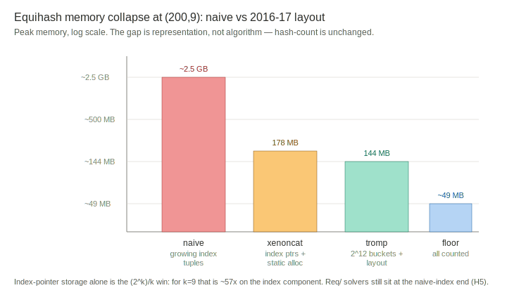
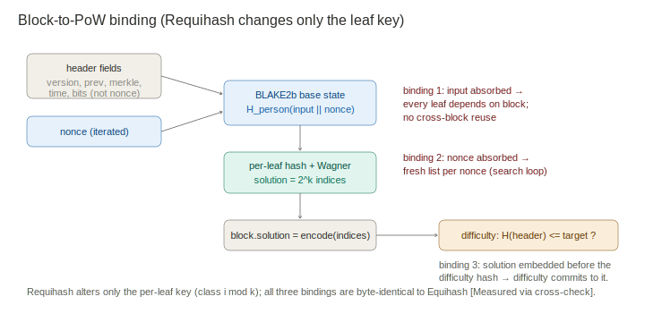
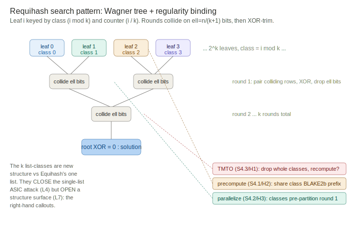

# SECURITY_ANALYSIS.md — Structural analysis of Equihash and Requihash: shortcuts, memory, and block binding

This document is a structural security analysis of the Equihash and Requihash
constructions as implemented in `Req/`. It hunts for shortcuts (parallelization,
precomputation, memory-reduction cracks), explains how the 2016-17 optimizations
cut memory many-fold by reasoning about the actual memory layouts and search
patterns, explains how block contents bind to the PoW computation, and then
derives, classifies, and applies lessons to Requihash. It closes with proposed
step-wise code changes and experiments. Findings context:
[../Equihash.md](../Equihash.md) F-A1 through F-A10; the TMTO frame is in
[TMTO.md](TMTO.md).

Method note: claims are graded — Structural (follows from the algorithm/layout by
construction), Measured (observed in the `Req/` harness), Hypothesis (a supposition
offered for discussion and testing). The analysis is deliberately adversarial:
the goal is to find where Requihash *could* be short-cut, not to defend it.

## Table of Contents

1. [The construction, exactly](#1-the-construction-exactly)
2. [Memory layouts and search patterns](#2-memory-layouts-and-search-patterns)
3. [How block contents bind to the PoW](#3-how-block-contents-bind-to-the-pow)
4. [Shortcut hunt: where Requihash could crack](#4-shortcut-hunt-where-requihash-could-crack)
5. [Lessons, enumerated and classified](#5-lessons-enumerated-and-classified)
6. [Applying the classification to Requihash construction types](#6-applying-the-classification-to-requihash-construction-types)
7. [Hypotheses for discussion](#7-hypotheses-for-discussion)
8. [Proposed step-wise code changes and experiments](#8-proposed-step-wise-code-changes-and-experiments)

## 1. The construction, exactly

Both schemes solve a generalized birthday problem over a list of hash values and
bind the solution to a block. The pieces, from the implementation and the
[Equihash paper](https://ledger.pitt.edu/ojs/ledger/article/view/48) §3.4:

- **Parameters** (n, k): a solution is a set of `2^k` indices; collisions happen on
  `ℓ = n/(k+1)` bits per round; the initial list has `N = 2^(ℓ+1)` entries.
- **Leaf generation.** Equihash: item j = `H(person ‖ input ‖ nonce ‖ j)`, all
  from one list. Requihash: item i = `H(person ‖ input ‖ nonce ‖ (i mod k) ‖ (i / k))`
  — the `i mod k` term is the regularity binding, keying each tree-leaf position to
  a list-class. (`Req/cpp/requihash.h::GenerateHash`, `rust/src/lib.rs::leaf_row`.)
- **Algorithm binding.** The solver runs Wagner's tree: sort/bucket by the round's
  ℓ-bit segment, pair colliding rows, XOR them (zeroing that segment), recurse. The
  binding is that the intermediate `2^l`-XORs must have their leading bits zero — a
  fixed algorithm flow — which the paper proves yields only ~2 solutions on average
  (amortization-free). Canonical lexicographic ordering of paired subtrees kills
  duplicate solutions from swaps.
- **Difficulty.** The block is valid when the hash of the header (which commits to
  the solution) meets the difficulty target — separate from solution validity.

The single structural difference between Equihash and Requihash is the `i mod k`
term in leaf generation. Everything below traces the consequences of that one term.

## 2. Memory layouts and search patterns

### 2.1 The expected (paper) layout vs the achieved layout

The Equihash paper's naive description implies a memory footprint that the 2016-17
solvers cut many-fold. The gap is entirely in how rows are *represented* and how
collisions are *found*.

**Expected layout (naive).** Each row carries its full accumulated index tuple. At
round r a row holds `2^r` indices (each `sizeof(eh_index)` = 4 bytes) plus its
remaining hash. Over k rounds the index storage per surviving row grows as
`2^r`, and the naive solver materializes growing *lists of full index tuples*.
For (200,9) this is where the paper-implied hundreds-of-MB figure comes from.

**Achieved layout (2016-17).** Four representational changes collapse this:

| Technique | What it changes in the layout | Memory effect |
|---|---|---|
| Index-pointer storage | Store a binary tree of index *pairs* (two parent pointers), not the full `2^r`-index tuple; reconstruct full indices only at the end | Index storage per row drops from `2^r` to O(1); saves a factor of `(2^k)/k` |
| Hash trimming | Drop the collided ℓ-bit segment after each round | Row hash shrinks `(k+1)·ℓ → ℓ` over the rounds |
| Incomplete bucket sort | Bucket by the collision digit; never hold a fully sorted copy | Removes the sort's second-array overhead |
| Static allocation | Size all buffers once from parameters | Removes per-round growth/fragmentation |

The compound effect is the many-fold reduction: index pointers alone are the
`(2^k)/k` win (for k=9 that is `512/9 ≈ 57x` on the index component), and the paper
records the concrete endpoint — xenoncat 178 MB, tromp 144 MB, and roughly 49 MB
once all of it is counted at (200,9) [Structural for the mechanism; Reported for the
figures, Equihash.md §3].



*Figure 1. The many-fold memory collapse is a representation effect: the naive
growing-index-tuple layout versus the index-pointer/hash-trimmed/static layout, log
scale. Hash-count is unchanged across all four bars — only resident bytes drop.*

### 2.2 Why the search pattern is what leaks the memory

The reason the memory could be cut is that the *search pattern* — Wagner's
bucket-and-merge — only ever needs the collision segment adjacent, never the full
index history. The indices are dead weight during the search; they are only needed
to emit the final solution. So representing them as reconstructable pointers costs
nothing during the search and everything is recoverable at the end. This is the
structural fact behind F-A1: **the memory hardness was never in the search, only
in the naive representation of the search's bookkeeping** [Structural].

This is also why the reduction is a *representation* attack, not an *algorithmic*
one: the number of hash evaluations and comparisons is unchanged; only the bytes
held resident drop. A memory-hard PoW whose memory lives in reconstructable
bookkeeping is not memory-hard in the bookkeeping.

### 2.3 The Req/ implementation's layouts, measured

The `Req/` solvers instantiate points on this spectrum, and the profile
(BENCHMARK.md) confirms the structural story:

- `solve::reference` — naive: per-row `Vec` for hash and full index tuple. 59% of
  time in allocation [Measured].
- `solve::arena` — flat struct-of-arrays, full explicit indices, hash-trimmed. 1.6x
  faster; the allocation share collapses [Measured].
- `solve::bucket` — arena + incomplete bucket sort (counting sort on the collision
  digit). Further 14%, 1.86x cumulative [Measured].
- Compact index-pointer storage (the `(2^k)/k` win) — **not yet implemented**; the
  arena/bucket solvers still carry full explicit index tuples, so they sit at the
  *high-memory* end. This is the single biggest unrealized memory reduction and the
  gate to (200,9) [Structural].

## 3. How block contents bind to the PoW

A PoW is only useful if the work is tied to the specific block, so it cannot be
precomputed or reused. The binding chain, from the zcash block header conventions
the implementation follows:

```
block header fields (version, prev-hash, merkle-root, time, bits)
        │  (all but nonce+solution)
        ▼
   input  ──┐
            ├──►  BLAKE2b base state = H_person(input ‖ nonce)     [person = scheme ‖ n ‖ k]
   nonce  ──┘
            ▼
   per-leaf:  H(base ‖ leaf-key)   ──►  Wagner solve  ──►  solution = 2^k indices
            ▼
   block.solution := minimal-encode(indices)
            ▼
   difficulty check:  H(full header incl. solution) ≤ target ?
```



*Figure 2. The binding chain. Requihash alters only the per-leaf key; the input,
nonce, and difficulty bindings are byte-identical to Equihash.*

Three bindings matter for security:

1. **Input binding.** The header (minus nonce/solution) is absorbed into the
   BLAKE2b base state, so the entire leaf list is a deterministic function of the
   block. Change any header field and every leaf changes — no cross-block reuse
   [Structural].
2. **Nonce binding.** The nonce is also absorbed, so each nonce yields a fresh
   independent list. The miner iterates nonces to find one whose list has a
   solution that also meets difficulty. This is the search loop.
3. **Difficulty binding.** Solution *validity* (is it a real GBP solution?) is
   separate from *difficulty* (does the block hash meet the target?). A nonce can
   yield a valid solution that fails difficulty; the miner keeps searching. This
   two-gate structure is why the solution is embedded in the header before the
   difficulty hash — the difficulty commits to the solution.

Requihash changes only leaf generation (the `leaf-key` becomes `(i mod k, i / k)`);
the input/nonce/difficulty binding is byte-identical to Equihash. The `Req/`
cross-check confirms the binding is preserved: a C++-mined solution for a given
(input, nonce) verifies in the independent Rust verifier [Measured].

## 4. Shortcut hunt: where Requihash could crack

The adversarial core. For each shortcut class, the question is whether the `i mod k`
regularity term opens or closes it relative to Equihash. The regularity is a
double-edged change: it *closes* the single-list index-pointer attack (its purpose)
but it also *imposes structure* an attacker might exploit.



*Figure 3. The search pattern and where each shortcut class attacks. The k
list-classes close the single-list ASIC attack (L4) but open a structure surface
(L7) — the right-hand callouts map to the subsections below.*

### 4.1 Precomputation

*Equihash exposure.* None across blocks (input binding), but within a nonce the
list is reused across the k rounds.

*Requihash change.* The `i mod k` term makes leaf i's hash depend on its
list-class. Because list-classes are fixed by tree position and there are only k of
them, **the k class-prefixes `H(base ‖ (c) ‖ ·)` for c in 0..k could be partially
precomputed** — the BLAKE2b state after absorbing `input ‖ nonce ‖ class` is shared
across all counters in that class. [Hypothesis, HIGH interest] This is a real
structural difference from Equihash: Requihash has k distinct sub-states where
Equihash has one. Whether it is exploitable depends on BLAKE2b's block boundaries —
if `input ‖ nonce ‖ class` fits in one 128-byte block, the shared prefix saves one
compression per leaf across a class. **This should be measured** (Experiment 3).
Note it does not break the scheme (the counter still varies per leaf) but it could
shave a constant factor off leaf generation, which matters because generation is
12-24% of solve.

### 4.2 Parallelization

*Equihash exposure.* Leaf generation is embarrassingly parallel; the merge is
sequential per round with a barrier; the paper's Proposition 7 gives a bounded
parallel speedup limited by memory bandwidth.

*Requihash change.* Leaf generation is *still* embarrassingly parallel (each leaf
independent — confirmed, `solve::parallel` gets 1.9x from gen-parallelism alone,
[Measured]). The regularity does not change the merge's sequential barrier. **But**
the regularity creates k independent list-classes, and the first merge round pairs
across classes in a fixed pattern — this is a *more* structured first round than
Equihash's homogeneous one. [Hypothesis, MEDIUM] A bucket-partitioned parallel
merge (the natural next Tier-2 step) may parallelize *more* cleanly on Requihash
than Equihash because the class structure pre-partitions the first round. This is a
benign shortcut (it helps honest miners and ASICs equally, so it does not shift the
decentralization balance) but it should be characterized.

### 4.3 Memory-reduction (the TMTO crack)

*Equihash exposure.* The Bernstein truncation tradeoff: store `N/q` elements, repeat
`q^(k+1)` times, penalty `C(q) = q^k` (or the improved `≈4·2^(n/(k+1))·q^((k+1)/2)`).
Alcock-Ren: no bound proven for the loose problem (TMTO.md §1b).

*Requihash change.* Requihash restores the regular k-list problem, so the paper's
*regular*-problem steepness k/2 (Prop 6) applies legitimately where it did not for
Equihash. [Structural for the applicability; Hypothesis for the concrete constant]
The 12x-penalty claim (F-A4) is this k/2 steepness at (200,9). **The crack to hunt
for**: does the k-class structure give a memory-reduced solver a *better* tradeoff
than the generic k/2? Specifically, a solver could hold only some classes resident
and recompute others — a class-selective tradeoff Equihash's single list does not
offer. [Hypothesis, HIGH interest — this is the most important open question]
If class-selective recomputation beats the generic q^(k/2) penalty, the 12x claim is
optimistic. Experiment 1 measures this directly.

### 4.4 Amortization

*Equihash exposure.* Algorithm binding limits solutions to ~2 per list; Gaussian
elimination (the amortization attack) is blocked by the bit-fixing.

*Requihash change.* The paper states Requihash is amortization-free under the same
algorithm binding, and adds that the regularity *removes* the duplicate-solution
nuisance via canonical ordering. [Structural] No new amortization surface is
evident — the ~2-solutions-per-list property is a property of the tree binding,
which Requihash keeps. Low concern, but the solution *count* per nonce should be
tracked empirically (the `Req/` bench already reports it: 1-5 solutions per solving
nonce at small params, consistent with the ~2 average) [Measured].

### 4.5 Structure-exploitation (the regularity's own risk)

The novel risk Requihash introduces that Equihash lacks: the `i mod k` term is a
*public, low-entropy* structural constraint (only k classes). [Hypothesis, MEDIUM]
Any attack that exploits knowing which class a leaf belongs to — e.g., precomputing
per-class collision tables, or a meet-in-the-middle that splits on class — is a
Requihash-only surface. The regular-syndrome-decoding literature (Esser-Santini
2024, cited in Equihash.md) is where such structure-aware attacks would come from;
the regular problem is *better studied* as an attack target than the loose one,
which cuts both ways: Requihash inherits both the regular problem's proven steepness
*and* its known attacks.

## 5. Lessons, enumerated and classified

The observations above sort into a classification along two axes: **what the
lesson is about** (representation / search / binding) and **whether it transfers to
Requihash unchanged, is closed by regularity, or is opened by regularity**.

| # | Lesson | About | Requihash status |
|---|---|---|---|
| L1 | Memory hardness in reconstructable bookkeeping is not memory hardness | Representation | Transfers — Requihash must use index pointers too, or it inherits the same fragility in reverse (high memory, not low) |
| L2 | The search pattern only needs the collision segment; index history is dead weight during search | Search | Transfers unchanged |
| L3 | Full-memory representation cost is separable from algorithmic (hash-count) cost | Representation | Transfers; the TMTO steepness is about the algorithmic cost, memory reduction about representation |
| L4 | Fixing the memory-access pattern is what makes a solver ASIC-friendly | Search | CLOSED by regularity for the single-list attack; the k-list access pattern is less ASIC-regular (F-A4) |
| L5 | Algorithm binding (bit-fixing) gives amortization-freeness and the steepness | Binding | Transfers — same binding mechanism |
| L6 | Block/nonce absorption into the base state prevents precomputation and reuse | Binding | Transfers, but Requihash adds k sub-states (L7) |
| L7 | Low-entropy public structure is an attack surface | Binding | OPENED by regularity — the k classes are new structure (§4.1, §4.5) |
| L8 | A restored regular problem inherits both proven bounds and known attacks | Search | OPENED-and-CLOSED — the double edge of §4.5 |

The classification's payoff: lessons L1-L3, L5-L6 transfer, so the `Req/`
implementation should adopt the same representation and binding discipline as a
good Equihash solver. L4 is the win Requihash was built for. **L7 and L8 are the
novel Requihash risks and the ones worth experiments** — they are where a shortcut,
if it exists, lives.

## 6. Applying the classification to Requihash construction types

Requihash "as specifically defined" (Tang-Sun-Gong Prop 1: `x_i` from list `i-1 mod
K`) is one point in a family. Applying the lessons methodically across construction
variants shows which choices are load-bearing:

| Construction variant | Regularity binding | L7 (structure) risk | L4 (ASIC) benefit | Verdict |
|---|---|---|---|---|
| Paper Requihash: `i mod k` class per leaf | k classes, sequential | Low-k = low entropy but simple | Full (single-list attack dead) | The defined scheme; L7 is its one new surface |
| Our impl: `(i mod k, i / k)` keying | Same k classes | Same | Same | Byte-equivalent to paper's intent [Measured] |
| Finer classes: `i mod (2k)` or per-round class map | More classes, more entropy | Lower (more entropy) | Same or better | Hypothesis: reduces L7 at no cost — worth testing |
| Hash-derived class: class = `H(i) mod k` | Pseudorandom class assignment | Lowest (no exploitable structure) | Possibly weaker (less regular) | Hypothesis: trades L7 for possible L4 erosion |
| Full permutation binding: class = π(i) for public π | Structured but high-entropy | Depends on π | Same | The general form; paper's `i mod k` is the simplest π |

The methodical observation: the paper's `i mod k` is the *minimal* regularity that
restores the regular problem, and its cost is the *maximal* L7 exposure (lowest
entropy). Every richer class map trades implementation complexity for reduced
structure-exploitation surface. **Whether the richer maps actually reduce a
measurable attack is the experiment** — if L7 turns out non-exploitable, the simple
`i mod k` is correct and richer maps are wasted complexity.

## 7. Hypotheses for discussion

Offered as suppositions to test, not claims:

- **H1 (class-selective TMTO).** A memory-reduced Requihash solver that holds some
  list-classes resident and recomputes others achieves a *better* tradeoff than the
  generic `q^(k/2)` steepness, because the k classes are a natural partition to
  drop. If true, the 12x penalty (F-A4) is optimistic and depends on k. *Highest
  priority — it targets the core security claim.*
- **H2 (class-prefix precomputation).** The shared BLAKE2b state after `input ‖
  nonce ‖ class` saves one compression per leaf across each class, a k-way constant
  speedup in generation that Equihash does not offer. Benign but real.
- **H3 (regularity aids parallelism).** The k-class pre-partition makes a
  bucket-parallel merge scale better on Requihash than Equihash. Benign
  (symmetric across honest/ASIC).
- **H4 (entropy-tunable L7).** Richer class maps (`i mod 2k`, hash-derived) reduce
  structure-exploitation surface at no security cost, making the simple `i mod k`
  a possibly-suboptimal choice. Testable only if L7 is shown exploitable at all.
- **H5 (representation symmetry).** Because Requihash *keeps* full explicit indices
  in our current solvers, it currently sits at the high-memory end — the mirror of
  Equihash's low-memory fragility. Until index-pointer storage lands, Requihash's
  measured memory is *not* representative of the scheme's floor. *This is a caveat
  on all current `Req/` memory numbers.*

## 8. Proposed step-wise code changes and experiments

Ordered by value (security-relevance first), each with what it would establish and
its rough size. All preserve the cross-validation gate (every new solver must pass
`all_solvers_agree`).

1. **Compact index-pointer storage (`solve::pointer`).** Store parent-pointer pairs;
   reconstruct indices at solution time. *Establishes*: the real memory floor of
   Requihash (H5), unblocks (200,9), and is the prerequisite for honest TMTO numbers.
   *Size*: medium — a new solver backend plus a reconstruction pass. **Do first.**
2. **Memory-capped solver (`solve::tmto`) with Bernstein truncation.** Parameter q;
   store `N/q` leaves, repeat, measure penalty vs q. *Establishes*: empirical
   steepness of the regular Requihash problem; direct test of the 12x claim
   (TMTO.md Experiment 1). *Size*: medium.
3. **Class-selective TMTO variant (tests H1).** Extend `solve::tmto` to drop whole
   list-classes rather than uniform truncation; compare its penalty curve to the
   generic one. *Establishes*: whether the regularity opens a better tradeoff — the
   single most important security experiment. *Size*: small once (2) exists.
4. **Class-prefix precomputation probe (tests H2).** Instrument leaf generation to
   share the per-class BLAKE2b state; measure the compression-count saving.
   *Establishes*: the k-way constant speedup and whether it is worth exploiting.
   *Size*: small.
5. **Bucket-parallel merge (tests H3, Tier 2).** Partition each merge round's
   buckets across threads; compare Requihash vs Equihash parallel efficiency.
   *Establishes*: whether regularity aids parallelism; also the next real perf win.
   *Size*: medium.
6. **Entropy-tunable class map (tests H4).** Make the class map pluggable
   (`i mod k`, `i mod 2k`, `H(i) mod k`); run (2)-(3) against each. *Establishes*:
   whether richer maps reduce a measurable attack. *Size*: small (a keying hook).
7. **Solution-count and duplicate audit.** Already partly measured; formalize the
   ~2-solutions-per-list check across parameters and confirm canonical ordering
   eliminates duplicates. *Establishes*: amortization-freeness empirically. *Size*:
   tiny.

The critical path is 1 → 2 → 3: honest memory floor, then real steepness, then the
class-selective attack that could undercut the whole Requihash value proposition.
Everything else is characterization around that spine.
