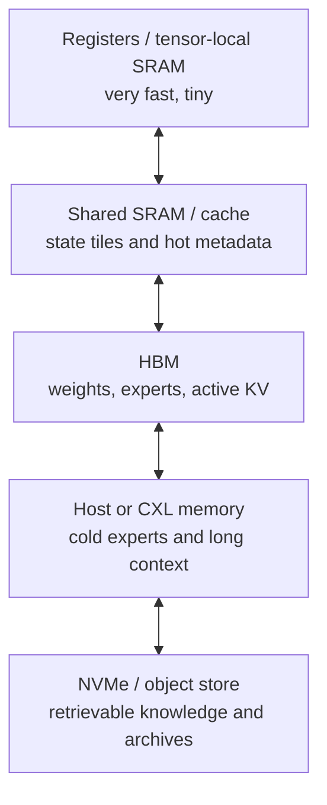

# Technical brief: model architectures compiled for hierarchical inference hardware

## The Transformer is not one workload

A decoder-only Transformer alternates projection-heavy blocks with attention and
feed-forward layers. During prefill, many input tokens are available at once;
matrix dimensions are large, arithmetic intensity is high, and tensor cores are
well used. During autoregressive decode, each sequence contributes one new token.
Weights are repeatedly streamed, matrix shapes become thin, and attention reads a
key–value cache that grows with sequence length. Prefill tends toward compute
limitation; decode tends toward memory bandwidth, capacity, scheduling, and
interconnect limitation.

Enterprise service adds continuous batching, shared prefixes, variable sequence
lengths, tool pauses, speculative branches, service-level latency, and model
routing. The abstract (O(n^2)) attention equation misses most of this machinery.
[FlashAttention](https://arxiv.org/abs/2205.14135) gained speed by tiling exact
attention around SRAM capacity and avoiding materialization of the score matrix.
[PagedAttention](https://arxiv.org/abs/2309.06180) gained throughput by managing
KV blocks like virtual-memory pages. Both results demonstrate that data structure
and schedule are part of the practical algorithm.

The opportunity is not simply to remove attention. It is to co-design what the
model remembers, how that state is represented, and where each part lives.

## The physical hierarchy

An inference system now contains at least five materially different stores:



Moving a value down this hierarchy buys capacity and loses bandwidth, latency, or
energy. A model architecture should expose reuse at the level where it occurs.
Dense global attention treats every prior token as potentially hot. A recurrent
state compresses history aggressively but may lose exact recall. Sparse retrieval
keeps history external but must predict which pieces matter. Mixture-of-experts
reduces arithmetic per token but can move large expert weights through the memory
system.

The right architecture is likely hybrid because language tasks need all three:
local detail, compact long-running state, and occasional exact retrieval.

## State-space and recurrent alternatives

[Mamba](https://arxiv.org/abs/2312.00752) makes state-space parameters depend on
the input, allowing the model to select what to propagate or forget. During
inference it updates fixed-size state rather than appending KV vectors forever.
Its hardware-aware scan allows parallel training even though inference is
recurrent. This is a strong fit for local state memory and streaming workloads.

The trade-off is information geometry. A fixed state is a lossy compression of an
unbounded sequence. Attention can revisit a precise old token; a state-space model
must have preserved the relevant feature in advance. Exact associative recall,
copying, and in-context learning can expose this difference. Hybrid architectures
that insert periodic local or global attention are therefore more credible than a
universal claim that recurrence supersedes attention.

[Hyena](https://arxiv.org/abs/2302.10866) uses implicit long convolutions and
data-controlled gating. Gated linear attention provides a recurrent form at
inference while retaining parallel training; the
[GLA paper](https://arxiv.org/abs/2312.06635) is a representative construction.
Linear recurrent networks have constant state per layer, which maps well to SRAM,
but their state often grows quadratically with feature dimension or requires
careful decay and normalization.

Hardware evaluation must include batch behavior. A recurrent model is excellent
for one streaming sequence, but thousands of independently updated states can
produce scattered reads and writes. Recent PIM studies such as
[Pimba](https://arxiv.org/abs/2507.10178) specifically target these state updates
because they remain memory-bound even after the KV cache disappears.

## Sparse attention and external memory

Attention matrices are empirically sparse for many tokens, but discovering the
sparsity can cost as much as computing attention. A useful sparse architecture
must make selection cheap, train the selection mechanism, and arrange selected KV
blocks so hardware reads coalesced regions.

The data structure should be a block store rather than a token array. Each block
contains keys, values, temporal range, summary features, and a routing code. A
small index chooses candidate blocks; local dense attention runs within them.
RetroInfer's [vector-storage treatment of KV](https://arxiv.org/abs/2505.02922)
is an example of moving from “cache” toward indexed state. This allows old blocks
to move from HBM to capacity memory while retaining a search representation in a
hot tier.

Sparse attention is not equivalent to personal or factual memory. KV blocks are
model- and layer-specific transient representations. They are difficult to inspect,
migrate, or correct. Durable external memory should return evidence or structured
state that a new model can encode afresh; KV paging should remain an execution
optimization.

## Mixture-of-experts is a placement problem

MoE routes each token to a small subset of experts. Nominal FLOPs depend on active
parameters while model capacity depends on total parameters. On a large cluster,
expert parallelism can distribute weights and use all-to-all communication. At the
edge, inactive experts still occupy memory or must be loaded, so total footprint
can dominate. A 2026 empirical study asks directly whether
[MoE helps on consumer and edge hardware](https://arxiv.org/abs/2606.21428) and
finds that memory footprint and dispatch can erase the active-parameter advantage.

Experts should be compiled with placement metadata. Frequently co-activated
experts can share an HBM partition; rare experts can reside in host memory; small
fallback experts can prevent a cold miss from stalling the request. Routing should
include a placement price during training or fine-tuning. Otherwise the model may
learn statistically elegant expert assignments that cause pathological network
traffic.

This suggests a hardware-aware loss term:

\[
L = L_{model} + \lambda_b B(route) + \lambda_m M(route)
    + \lambda_t T_{tail}(route),
\]

where (B) estimates transferred bytes, (M) estimates capacity pressure, and
(T_{tail}) penalizes routing patterns that create latency outliers. These costs
should be estimated from a target-machine description, not hard-coded to one GPU.

## Low precision should be heterogeneous

Storage precision, multiplication precision, and accumulation precision need not
match. Weights are relatively static and can tolerate aggressive quantization;
activations vary by token and contain outliers; reductions accumulate many terms
and need additional range. Treating the whole network as “4 bit” hides these roles.

The [OCP Microscaling formats](https://www.opencompute.org/documents/ocp-microscaling-formats-mx-v1-0-spec-final-pdf)
store a shared scale for a small block and tiny floating-point elements within it.
This is a form of block floating point: nearby values share range metadata, making
the datapath and storage cheaper than independent full exponents. Blocks should be
formed around correlated channels or tiles; arbitrary grouping increases
quantization error.

[BitNet b1.58 2B4T](https://arxiv.org/abs/2504.12285) uses ternary weights
({-1,0,+1}) and 8-bit activations in a model trained from scratch on four
trillion tokens. A ternary dot product replaces weight multiplication with add,
subtract, or skip. Packing can approach 2 bits per weight, though practical layouts
need alignment and scale metadata. The zero symbol creates sparsity, but hardware
must exploit it without spending more on decoding and branches than it saves.

Ternary models are not yet evidence that frontier models can universally discard
higher precision. The open result is valuable because it makes native training,
not post-training approximation, a realistic research direction. Scaling laws,
reasoning quality, multilingual performance, tool use, and training stability at
larger sizes remain to be established.

Logarithmic number systems make multiplication and division into addition and
subtraction of exponents. They are attractive for positive products, normalization,
and dynamic-range-heavy signals. Addition in the log domain requires evaluating
(log(1+e^x)) or an approximation; cancellation between positive and negative
values is difficult. A signed neural network dominated by reductions is therefore
not an obvious universal LNS workload.

Posits provide tapered precision—more precision near common magnitudes and wider
range with fewer fraction bits—but require nonstandard decode and accumulation.
Their potential should be tested against microscaling formats that already have
multi-vendor momentum. A technically elegant representation without compiler,
kernel, and interconnect support usually loses to a slightly less efficient format
embedded throughout the stack.

The practical design is mixed: ternary or INT4 weights, per-tile power-of-two or
microscaling factors, INT8/FP8 activations, wider integer or FP16 accumulation,
and an outlier side channel.

## A proposed compiled architecture: Hierarchical Routed State blocks

The proposed unit is not a layer but a **Hierarchical Routed State (HRS) block**.
It combines a small recurrent state update, local attention, optional external
block retrieval, and a routed feed-forward transform. The model compiler decides
which suboperations are resident at each memory tier.

For token (x_t), an HRS block performs:

\[
r_t = R(x_t, s_{t-1}),\qquad
u_t = A_{local}(x_t, K_{window}, V_{window}),
\]

\[
e_t = Retrieve(q(x_t,s_t)),\qquad
y_t = ExpertRoute(x_t,r_t,u_t,e_t),
\]

where (s_t) is fixed-size recurrent state, the local window remains in fast
memory, and retrieval is invoked only when a confidence or novelty gate justifies
its latency. Periodic global-attention blocks can preserve exact in-context
reasoning where recurrence is weak.

The compiled weight/state tile could use this layout:

```text
HRS tile
  descriptor: op kinds, dimensions, residency, version
  routing: expert IDs, co-location group, fallback expert
  quantization: shared scales, zero points, outlier policy
  structure: sparsity bitmap or fixed N:M pattern
  payload: packed ternary / INT4 / MX weights
  exception lane: wider outlier weights and activations
  state map: SRAM offsets, HBM pages, external block handles
  integrity: checksum and deterministic decode version
```

Fixed-pattern sparsity is less expressive than arbitrary pruning but easier to
compile into deterministic memory transactions. The exception lane keeps a small
fraction of high-impact values in wider precision. A learned residency controller
can recommend placement, while the runtime retains authority to move blocks under
load.

The architecture's most important property is graceful degradation. If external
retrieval is slow, the recurrent and local paths still produce an answer. If an
expert is cold, a resident fallback handles the token. If a target lacks ternary
hardware, the packed representation expands into SIMD-friendly integers. This
portability matters commercially because model training outlives a single
accelerator generation.

## Compiler and runtime implications

The compiler needs a machine description containing SRAM capacities, HBM channels,
interconnect topology, supported number formats, gather cost, and PIM operations.
It should partition the graph by bytes transferred and tail latency, then emit
placement and prefetch plans. Traditional operator fusion is insufficient because
the expensive decision may be whether an expert or state block is resident before
the operator begins.

Runtime scheduling should distinguish prefill, decode, retrieval stalls, and
speculative branches. Prefix sharing and radix-tree caches can prevent repeated
prefill. Decode batching should group requests by resident experts and compatible
state layout without violating latency budgets. PIM or near-memory execution
should receive bandwidth-heavy, low-control-flow operations; tensor cores should
receive large dense or structured-sparse tiles.

## Business significance

Dense Transformer compatibility protects incumbent GPU vendors because every new
model maps onto mature tensor kernels and cluster software. A successful HRS-like
architecture could redistribute value toward memory capacity, compilers,
near-memory logic, and inference-specific chips. It could also deepen incumbent
advantage if only vertically integrated vendors can coordinate model training,
runtime, networking, and silicon.

Low-bit native models reduce weight bandwidth and may make CPUs, edge NPUs, and
commodity memory more competitive. They also lower the capital needed to serve a
given model, compressing inference margins unless demand expands. Specialized
hardware is investable only if a stable model family and compiler ecosystem emerge;
support for one research checkpoint is not a market.

The defensible product may be the intermediate representation and compiler. A
portable block format that maps the same trained model onto GPUs, CPUs, FPGAs,
PIM, and future ASICs creates leverage across hardware cycles.

## Specific continuation methodology and open questions

Implement one HRS block in a controlled 300M–1B parameter model. Compare four
variants under the same data and training compute: dense attention, local attention
plus recurrence, recurrence plus retrieval, and the full routed block. Measure
exact recall, reasoning, perplexity, long-sequence quality, and tool-use behavior;
do not optimize only language-model loss.

Build a trace-driven memory simulator from real serving logs. Record expert
activation, KV access, recurrent-state updates, retrieval, prefix reuse, and
request deadlines. Replay it against HBM-only, HBM+CXL, edge unified memory, and
PIM configurations. This will reveal whether architectural gains survive realistic
batch fragmentation.

Prototype the tile format in Triton/CUDA, AVX-512/AMX, and FPGA. Measure decode
cost for ternary packing, masks, shared scales, and outliers. The key comparison is
end-to-end joules and tail latency, including format conversion—not nominal MAC
count.

Train the routing system with explicit placement penalties and then perturb the
hardware topology. Does it generalize, or does hardware-aware training lock the
model to one machine? Can a lightweight retuning step adapt placement without
retraining semantic weights?

Finally, determine which state deserves to be recurrent, which deserves exact
attention, and which should leave the model entirely. The boundary between neural
state and external structured memory is likely more important than the choice
between FP4 and ternary arithmetic.
