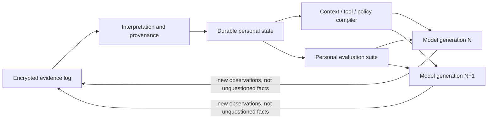

# Technical brief: private personalization that survives model succession

## The object that should persist

A person may use an assistant for fifty years while the base model changes every
few months. Weight-level personalization attaches the slow asset to the fast one.
Even a small LoRA adapter depends on layer dimensions, tokenizer, representation,
and behavior of a particular base model. When that base disappears, the adapter
becomes a historical artifact.

Raw interaction history is portable but not sufficient. A million messages contain
duplicate facts, abandoned plans, sarcasm, third-party information, corrections,
and model errors. Retrieval can recover passages without knowing which statement
is current or whether the assistant was entitled to generalize it.

The durable object should be a **personal learning substrate**: evidence, typed
interpretations, executable preferences and procedures, and tests. A base model is
one compiler target. Prompts, retrieval results, tool policies, and adapters are
generated artifacts.



## Evidence and interpretation must remain separate

An event log records what was observed: a message, document, calendar change,
purchase, correction, or tool result. It is append-only and content-addressed;
deletion can be represented by cryptographic erasure of per-record keys or by
retention policies, depending on the required audit model. Each event identifies
source, time, participants, access domain, and parser version.

Interpretation produces claims from evidence. A claim is not simply a knowledge
graph triple. It needs at least a subject, predicate, value, validity interval,
confidence, provenance, and status. Two times are essential:

- **valid time:** when the claim applied in the represented world;
- **transaction time:** when the system learned, revised, or retracted it.

This bitemporal distinction handles “I lived in Boston until 2024” learned in
2026 without rewriting history. The [Zep/Graphiti architecture](https://arxiv.org/abs/2501.13956)
is a practical example of temporally aware graph memory, though a decades-long
system needs stronger provenance and migration semantics than a retrieval service
alone.

Derived claims should form a dependency graph. If an address changes, the system
can invalidate shipping defaults derived from the old address without deleting
the historical event. If a model inferred “prefers morning meetings” from three
calendar choices, that claim remains distinguishable from a direct user statement.
Confirmation can promote it; contradiction can weaken it.

A compact representation might look like:

```text
claim_id: c_7421
subject: user
predicate: scheduling.preferred_start
value: 09:30 local
context: {meeting: external, weekday: true}
valid: [2025-03-01, open)
learned: 2025-05-13T18:42Z
status: inferred
confidence: 0.71
evidence: [event_88, event_104, event_119]
supersedes: c_5102
read_scope: scheduling-agent
```

The value of this structure is not graph fashion. It permits correction,
explanation, scoped disclosure, temporal queries, and regeneration by a different
model.

## Preferences are functions, not profile strings

“The user likes concise answers” is the kind of shallow memory that becomes wrong
through overgeneralization. A useful preference maps context to a distribution or
constraint. Concision may be preferred for operational questions, rejected for
research, and overridden when uncertainty or financial stakes are high.

A preference learner can treat interactions as pairwise evidence. When the user
edits an answer, requests more detail, accepts a recommendation, or reverses a
decision, the system records an observation with context. A small model estimates

\[
P(a \succ b \mid task, stakes, device, audience, time),
\]

rather than generating a universal prose rule. Stable, high-confidence regions
compile into policies; ambiguous regions prompt lightweight choice or preserve
multiple hypotheses.

This is more data-efficient than fine-tuning a frontier model because the learned
object is low-dimensional and explicit. It is also more portable. A new base model
can be tested against the same preference pairs and prompted or adapted only where
it fails.

## Procedures are programs with tests

Many valuable personalizations are procedural: how to prepare a board memo, how
to reconcile an account, how to review a pull request, or how to plan a trip. Text
examples alone leave the assistant to rediscover the process each time.

A procedure should be represented as a versioned graph of typed steps, tool
contracts, preconditions, branching rules, and acceptance tests. Natural language
remains useful for intent and exceptions, but the operational core should be
executable. The assistant can propose a revision after observing repeated edits;
the old version remains available for past projects.

This creates a path to genuine post-training learning without touching base
weights. The system improves because its programs, selectors, and tests improve.
A model upgrade can run the procedures' regression suite. If the new model follows
instructions differently, the compiler or procedure can be repaired before the
user experiences silent drift.

## Memory should compile into several mechanisms

[MemGPT](https://arxiv.org/abs/2310.08560) treats context as virtual memory and
lets the model move content between tiers. That is useful execution machinery, but
not every durable state item belongs in the prompt.

The compiler can choose among four outputs. Evidence needed for the present
question becomes retrieved context. Deterministic constraints become tool or policy
checks. Stable behavioral preferences become a compact prompt fragment or a small
adapter. Repeated procedures become callable programs. The choice should be based
on measured reliability and cost.

Adapters are valuable compiled caches. LoRA can teach stable style or domain
behavior without modifying all weights, and federated variants can aggregate some
learning without centralizing raw data. But the durable source should be the
preference examples, procedure tests, and evidence. On model replacement, adapters
are retrained or discarded. The original [LoRA construction](https://arxiv.org/abs/2106.09685)
freezes the base model and learns low-rank updates to selected weight matrices;
[FLoRA](https://papers.neurips.cc/paper_files/paper/2024/file/28312c9491d60ed0c77f7fff4ad86dd1-Paper-Conference.pdf)
shows how heterogeneous low-rank adapters can be aggregated in a federated setting.
Both are useful mechanisms, but neither supplies a stable semantic identity across
unrelated base architectures.

Direct model editing is even less portable. [MEMIT](https://memit.baulab.info/)
can alter thousands of factual associations in particular Transformer families,
showing that weights can act as editable memory. It also demonstrates the problem:
specific layers, causal traces, and weight geometry matter. An edit has difficult
provenance, uncertain side effects, and no obvious migration to a new architecture.
For personal systems it is an optimization target, not the authoritative store.

## Retrieval must reason about time, source, and absence

[LongMemEval](https://arxiv.org/abs/2410.10813) decomposes long-term conversational
memory into extraction, multi-session reasoning, temporal reasoning, updates, and
abstention. Commercial systems often report a single retrieval or answer score,
which hides dangerous differences. Returning an old address is worse than failing
to recall a favorite color. Confidently inventing a preference is worse than asking.

A query planner should identify the state operation before searching. “What did I
think then?” asks for historical validity. “What should I do now?” asks for current
claims plus applicable procedures and preferences. “Why do you believe that?” asks
for provenance. Vector similarity can propose evidence, but bitemporal and graph
filters enforce semantics.

Absence needs representation. The system should distinguish no evidence, withheld
evidence, expired evidence, contradictory evidence, and evidence outside the
requesting agent's scope. Otherwise a model will convert unavailable information
into a confident negative.

## Private operation is an architectural constraint

The cleanest trust boundary keeps raw evidence and authoritative personal state on
user-controlled devices or a user-controlled encrypted service. Models receive
the least state required for a task. Each tool or agent has a capability describing
which predicates and evidence classes it may read or write. A travel planner may
read passport validity without reading medical correspondence; a writing model
may use style preferences without accessing finances.

Encryption at rest is necessary and uninteresting by itself. The harder controls
are inference-time disclosure, cross-domain joins, logs, backups, model-provider
retention, and malicious retrieved content. Memory ingestion is a security parser:
a document can contain instructions attempting to turn itself into trusted policy.
Source type and write authority must therefore be enforced outside the model.

Federated learning and differential privacy can improve shared components, but
they solve a different problem. Differential privacy limits what aggregate updates
reveal under a formal budget; it reduces utility and does not make a compromised
client safe. Federated learning leaves raw data local but exposes gradients or
adapters unless secure aggregation and other protections are used. Neither is
required for private individual learning that does not need cross-user aggregation.

## The migration problem is the product

When a new model arrives, the system should run a succession protocol. It evaluates
the model on personal procedures, preference comparisons, correction handling,
permission boundaries, temporal questions, and abstention. It then selects prompt
compilation rules, retrieval policy, and optional adapters. Differences from the
previous model are reported at the level of capabilities and failing cases, not
generic benchmark scores.

This is analogous to database migration and compiler retargeting. The durable
schema has versions. Extractors and ontology mappings are replayable. Derived
claims record which model and prompt created them. A new interpreter can revisit
old evidence without silently overwriting prior interpretation. High-stakes state
may require user confirmation before promotion.

Model succession turns rapid frontier progress from a threat into an advantage:
the personal substrate can adopt a better model while preserving continuity. A
vendor that stores personalization only in proprietary weights creates lock-in but
also makes every model transition risky.

## Commercial structure

The defensible asset is a portable personal state format plus its compiler,
evaluation, and permission runtime. Storage alone is commoditized; embeddings can
be regenerated. A longitudinal corpus is valuable but creates liability unless its
semantics and access are controlled. The product earns trust by making corrections,
provenance, and migrations observable.

Several business models follow. A local personal appliance can sell privacy and
continuity. An enterprise version can preserve institutional procedures and role
knowledge across employee and model turnover. A neutral memory layer can serve
multiple model providers and charge for orchestration rather than inference. The
central competitive risk is that a model platform bundles adequate memory and
uses distribution to overwhelm a technically superior independent layer.

Interoperability is therefore strategic. An export should include evidence,
claims, schemas, procedures, tests, permissions, and cryptographic identities—not
only text transcripts. A credible standard can create a market for compatible
models and tools.

## Specific continuation methodology and open questions

Build a *model succession benchmark*, not another static memory QA set. Generate a
multi-year event stream with changing addresses, relationships, preferences,
procedures, permissions, uncertain inferences, and deliberate corrections. Process
the first years with one model, migrate twice to different architectures or
vendors, and test whether meaning and behavior survive. Include tasks whose correct
answer is abstention or refusal to cross a scope boundary.

Implement bitemporal claims and dependency invalidation in a small local store.
Compare three retrieval systems over identical evidence: vector passages,
temporal graph claims, and a hybrid query planner. Measure current-fact accuracy,
historical accuracy, correction propagation, provenance quality, and tokens
disclosed to the model.

Learn conditional preferences from edits and pairwise choices. Test whether a
small explicit preference model plus prompt compiler outperforms LoRA on new base
models. Measure the amount of user evidence needed to recover behavior after each
migration and whether old preferences are over-applied to new contexts.

Represent several real procedures as executable graphs with tests. Upgrade the
base model and observe which steps fail. This distinguishes model capability drift
from memory failure and makes personalization improvements measurable.

The hard open questions are semantic. How should the system distinguish a passing
remark from a durable preference? When may it infer a sensitive fact? How should
confidence decay when behavior changes? Can a personal ontology evolve without
breaking old procedures? How can derived state be deleted when it has influenced
later conclusions? Those are data-structure and algorithm questions with direct
product consequences—not matters solved by accumulating a larger vector database.
