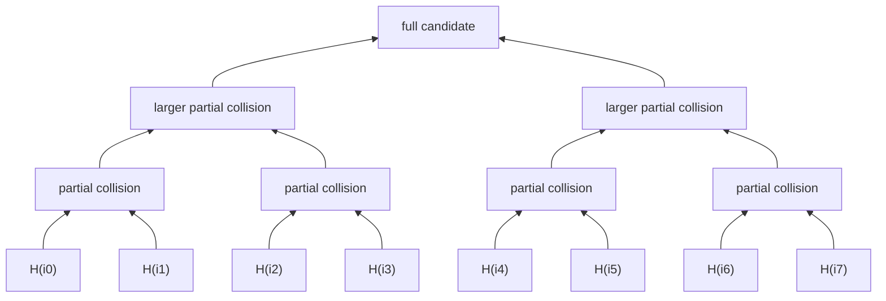

# Technical brief: memory-hard proof of work after Equihash

## The actual object being optimized

Equihash is based on the generalized birthday problem. Given a hash function whose
output is treated as an (n)-bit string, the solver seeks (2^k) distinct inputs
whose hashes XOR to zero, subject to a tree structure that records successive
partial collisions. Wagner's algorithm reduces the search dimension in rounds.
At each round, records are grouped by a fragment of their current value; matching
records are combined, the matched fragment disappears, and enough ancestry is
retained to recover the original inputs.

For intuition, a solver for (k=3) creates eight-leaf solutions:

The textbook description says “sort the list” each round. Efficient solvers rarely
perform a comparison sort. They extract just enough key bits to assign records to
buckets, process collisions locally, and stream compact output into the next
round. This distinction explains much of the progress after the original
[Equihash construction](https://eprint.iacr.org/2015/946.pdf).

The record is as important as the collision operation. A naïve entry stores the
remaining hash value and all descendant indices. An optimized entry may store a
hash fragment and two pointers into the previous layer. Another may trim parents
that cannot lead to a solution. A low-memory solver may discard much of the
ancestry and replay earlier rounds for the few surviving candidates. Each layout
changes the number of memory bytes transferred per candidate and the amount of
random access required to reconstruct a proof.

## What happened in the first optimization wave

Zcash launched with Equihash(200,9), implying solutions with 512 indices. Early
reference solvers were quickly displaced by compact bucketed implementations.
John Tromp's solver work and Marc Bevand's
[silentarmy](https://github.com/mbevand/silentarmy) are useful engineering records:
the latter exposes an OpenCL solver, specialized BLAKE2b work, fixed-size buffers,
and a Stratum-facing miner. Alexander Peslyak's 2016
[implementation analysis](https://www.openwall.com/articles/Zcash-Equihash-Analysis)
describes two decisive ideas: remove records no longer referenced by live pairs,
and use incomplete bucket sorting that never creates globally sorted lists.

Those optimizations changed practical memory requirements without changing the
abstract solution predicate. They also exposed a recurring weakness in claims
about ASIC resistance: a bound stated in number of list entries can miss the
freedom to encode each entry differently.

The 2019 [adversary-solver study](https://www.ndss-symposium.org/wp-content/uploads/2019/02/ndss2019_09-5_Bai_paper.pdf)
went farther by constructing a parameter-independent hardware design. Its
significance is not that one chip diagram settled the mining market. It is that
ASIC resistance must survive adversarial architecture work, including tailored
bucket memories and solver cores, rather than a comparison between an unoptimized
CPU and an imagined hash ASIC.

## The 2026 result changes the current baseline

Tang, Ding, Sun, and Gong's [*Memory Optimizations of Wagner's Algorithm with
Applications to Equihash*](https://doi.org/10.46586/tches.v2026.i2.218-239)
systematizes two different trade-offs.

*List-size reduction* reduces the number of candidates maintained. Because fewer
partial collisions survive, the work required to recover enough final solutions
can rise extremely quickly. This is the source of older claims that halving memory
causes prohibitive penalties for Equihash(200,9).

*List-item reduction* leaves candidate cardinality closer to the efficient regime
but shrinks the information stored per candidate. The paper develops constrained
single-chain and post-retrieval methods that reconstruct solution ancestry during
a second pass. The reported peak-memory reductions exceed 50 percent in the
studied configurations, with a practical penalty closer to twofold than to the
astronomical factors associated with list-size reduction. Its proof-of-concept code
is published in the [Wagner-Algorithms repository](https://github.com/tl2cents/Wagner-Algorithms).

This suggests two conclusions. First, Equihash remains a fertile algorithm-engineering
subject. Second, its original time–space security narrative must be updated. The
new methods do not necessarily give a miner a superior cost per solution: extra
passes consume bandwidth and energy. They do offer an ASIC designer more freedom
to balance on-chip memory, external memory, and recomputation.

## Comparing later memory-oriented PoWs

RandomX and Cuckoo Cycle illuminate different design choices. Cuckoo Cycle searches
for cycles in a challenge-derived graph. Its working set is graph edges rather
than Wagner lists, but [time–memory trade-off analysis](https://www.cs.cmu.edu/~dga/crypto/cuckoo/analysis.pdf)
again shows that graph representation and edge trimming matter. RandomX uses a
2,080 MiB dataset in fast mode, a 256 MiB cache, generated programs, branches,
integer and floating-point operations, and a scratchpad. The
[specification and audits](https://github.com/tevador/RandomX) make it a better
comparison than superficial “CPU-friendly” descriptions: its objective is to make
specialization reproduce a costly fraction of a modern CPU, including its memory
system and instruction machinery.

Autolykos v2 is more GPU-oriented. It binds solving to a large table and repeated
lookups, with the table growing over time. The useful question is not which scheme
is most memory-hard in the abstract. It is what advantage a specialist receives
from LPDDR, HBM, SRAM, custom controllers, narrower arithmetic, omitted coherence,
and a workload-specific pipeline.

Argon2 is relevant as a rigorously studied memory-hard function, but password
hashing and PoW are different markets. Password hashing values per-instance memory
and resistance to massively parallel guessing. A miner repeats one public puzzle
family continuously and can amortize hardware, code generation, and dataset setup.
The [Argon2 RFC](https://www.rfc-editor.org/rfc/rfc9106.html) mentions PoW
applications, but parameter selection and adversarial economics must be rebuilt
for a consensus deployment.

## Promising engineering investigations

The first prototype should reproduce, not redesign. A common challenge generator
should feed four solvers: a clear reference implementation, a Tromp-style compact
bucket solver, the 2026 list-item-reduction design, and a GPU implementation. Every
record allocation, bucket pass, ancestry read, and replay should emit a compact
trace. Hardware counters can then measure cache and TLB behavior, while board-level
telemetry measures energy.

The key plot is not solutions per second. It is total cost per valid solution as a
function of memory technology and capacity. A solver with half the memory and two
passes may be unattractive on a GPU whose HBM is already provisioned, yet attractive
on a custom device that replaces HBM with inexpensive LPDDR or fits key structures
in SRAM. The analysis should model dollars per GiB, bandwidth per watt, controller
area, packaging, and resale value.

A second experiment should vary ancestry representation independently from
collision processing. Candidate formats include full index vectors, parent
pointers, layer-relative offsets, checkpointed ancestry, succinct bit-packed
paths, and no ancestry before replay. This isolates where compression helps and
where pointer chasing destroys coalescing.

A third experiment should test a hybrid hierarchy. Early layers are large and
regular; late layers are small and dependency-heavy. They need not use the same
memory or processor. A GPU or wide SIMD engine can generate and bucket early
records, while CPU cores or local SRAM process late collision chains and proof
reconstruction. The transfer boundary should be selected from measured live-set
and bandwidth, not from the nominal Wagner round number.

## Algorithm changes worth considering—but not yet proposing for a chain

A modern successor could bind work to several memory behaviors rather than one.
One segment would perform high-bandwidth bucket formation; another would follow
challenge-derived dependencies through a large dataset; a final segment would run
a small generated program. The block challenge would determine permutations and
operation mixes. This would combine Equihash's verifiable witness, RandomX-like
general computation, and explicit hierarchy pressure.

The attraction is a broader hardware footprint. The risk is an algorithm too
complex to analyze, verify, or implement consistently. Composition does not
automatically inherit the best time–space bound of each component. It may instead
permit miners to optimize the cheapest component or pipeline multiple nonces in a
way the designer did not anticipate.

Dynamic memory schedules also deserve a sober examination. Growing the working
set can keep the puzzle outside old ASIC memory, but it favors miners able to fund
recurring hardware upgrades and creates a protocol-controlled obsolescence curve.
A schedule indexed to commodity capacity can be gamed by vendors and may make
verification expensive on small nodes. Governance cost belongs in the algorithm
analysis.

## Commercial interpretation

Memory hardness changes which bill dominates mining. SHA-256 mining capital is
mostly irrecoverable outside compatible chains. A GPU-oriented puzzle gives miners
equipment with AI, graphics, and rendering resale markets, but also makes rentable
attack capacity easier to obtain. A CPU-oriented puzzle distributes installed
capacity broadly, while data-center operators still benefit from power, cooling,
and fleet management. An HBM-oriented puzzle may simply transfer rents to a
scarce-memory supply chain.

The relevant business thesis is therefore not decentralization by slogan. It is
whether the puzzle produces a mining supply curve with many independent sources,
limited proprietary bottlenecks, and tolerable attack-rental liquidity. That can
be estimated from hardware inventories and cloud pricing once the solver trace is
known.

## Open questions and continuation methods

1. Reproduce the 2026 list-item-reduction results against the fastest surviving
   Tromp-family code, using identical parameters, compiler settings, and proof
   rates. Publish record formats and peak *live* memory, not allocator reservation.
2. Determine whether ancestry replay is bandwidth-bound, compute-bound, or
   latency-bound on DDR5, LPDDR5X, HBM3E, and large-cache CPUs.
3. Synthesize the bucket and ancestry kernels to FPGA, then estimate SRAM, DRAM
   channels, clock, and energy. GPU comparisons alone cannot answer ASIC advantage.
4. Test multi-nonce interleaving. A design that appears latency-hard for one nonce
   may become throughput-efficient when an ASIC keeps thousands in flight.
5. Re-evaluate proof size and verification if parameters are moved toward modern
   memory capacities. Larger prover memory is useful only if full nodes remain
   cheap and denial-of-service resistant.
6. Model cloud-rental attacks and hardware resale alongside silicon efficiency.
   Protocol security depends on accessible capacity, not just joules per proof.
