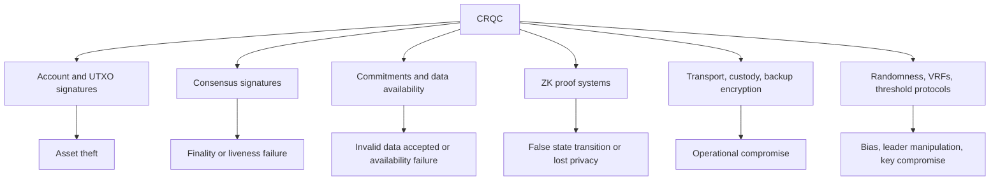

# Technical brief: post-quantum cryptocurrency is a system migration, not a signature swap

## What changed in 2026

The relevant threshold is a *cryptographically relevant quantum computer* (CRQC):
a fault-tolerant machine able to run a useful cryptanalytic circuit before its
target or opportunity disappears. Raw physical-qubit announcements are poor
proxies. Logical qubits, logical error rate, non-Clifford gate production, circuit
depth, routing, measurement latency, and the time available for an attack determine
whether a machine matters.

Google Quantum AI's March 2026 paper,
[*Securing Elliptic Curve Cryptocurrencies against Quantum Vulnerabilities*](https://quantumai.google/static/site-assets/downloads/cryptocurrency-whitepaper.pdf),
is important because it reduces the algorithmic resources for the 256-bit
elliptic-curve discrete-log problem. Its disclosed designs use fewer than 1,500
logical qubits, with a commonly cited configuration around 1,200, roughly twenty
times below earlier estimates used in public discussion. The authors validate
withheld circuit details through a zero-knowledge proof, so independent evaluation
of every optimization is intentionally limited.

This is not evidence that a CRQC exists or will exist on a specified date. It does
alter risk management. A cryptocurrency migration has a long software, hardware,
governance, and user-adoption tail. If resource estimates can improve discontinuously,
waiting for a hardware demonstration is equivalent to choosing an emergency
migration.

The threat is asymmetric. A quantum attacker need not operate continuously or
attack all cryptography. One machine can target the highest-value exposed keys,
bridge administrators, exchange hot wallets, stablecoin issuers, governance
multisigs, or validator infrastructure. Its existence may first become visible as
valid unauthorized transactions, at which point distinguishing theft from
legitimate key use is intrinsically difficult.

## Separate the quantum algorithms

Shor's algorithm solves integer factorization and discrete logarithms in polynomial
time on a sufficiently capable quantum computer. It threatens ECDSA and Schnorr on
secp256k1, EdDSA, BLS signatures, pairing-based commitments, and many SNARKs.
These primitives protect ownership or consensus; a successful attack produces
valid-looking authorization.

Grover's algorithm searches an unstructured (N)-element space in approximately
√(N) quantum queries. Its effect on a 256-bit hash is often summarized as
“128-bit security,” but a mining application is more complicated. Quantum queries
are deep reversible circuits, parallel speedup is sublinear, and the block target
changes. Difficulty adjustment absorbs a stable mining advantage. Quantum search
could eventually alter mining economics, but it is not the same discontinuous
failure as deriving a private key from a public key.

Collision finding has its own quantum algorithms and parameter implications.
Post-quantum analysis must therefore identify whether a hash is used for preimage
resistance, collision resistance, a Merkle commitment, Fiat–Shamir challenges, or
PoW. “Uses SHA-256” is not a security analysis.

## The cryptocurrency attack surface

Public-key exposure is chain-specific. Classic pay-to-public-key-hash Bitcoin
outputs hide the public key until spend, but early pay-to-public-key outputs,
reused addresses, and Taproot outputs expose keys under different conditions. A
fast quantum attacker could observe a spend, derive the key, and race a replacement
transaction; a slower machine would concentrate on keys already exposed at rest.
Dormant exposed outputs create the hardest policy question because legitimate
owners may be absent and no classical signature can distinguish them from a future
quantum thief once the key is recovered.

Account chains commonly expose a public key after the first outgoing transaction.
Smart-contract accounts can be more agile if their validation logic is replaceable.
They also concentrate risk in application-layer upgrade keys and bridges. A chain
can migrate its base transaction signature while leaving billions of dollars
behind vulnerable proxy administrators.

Proof-of-stake adds consensus credentials. Ethereum's BLS aggregation lets a large
validator set communicate compactly. Replacing individual BLS signatures with a
large post-quantum signature without aggregation would multiply bandwidth and
verification cost. The [Ethereum post-quantum program](https://pq.ethereum.org/)
therefore combines XMSS-derived signatures, a minimal proof VM, signature
aggregation, account abstraction, and changes to data commitments. That is a
representative system response: substitution at one layer creates load at another.

Privacy chains have additional exposure. Zcash's historical and current proof
systems use different assumptions; shielded note ownership, nullifiers, commitment
trees, viewing keys, proving systems, and recursive components require separate
analysis. A quantum break of a signature can steal transparent funds. A break in a
proof or commitment system may permit counterfeit shielded value or invalidate the
privacy model. Monero must consider EdDSA-derived authorization, linkable ring
signatures, key images, commitments, and the historical permanence of transaction
data. “Replace wallet signatures” is insufficient for both.

## Candidate primitive families

NIST finalized [ML-KEM, ML-DSA, and SLH-DSA](https://www.nist.gov/news-events/news/2024/08/nist-releases-first-3-finalized-post-quantum-encryption-standards)
in 2024. FN-DSA, derived from Falcon, remains a separate standardization effort.
Their blockchain suitability is not ordered simply by NIST preference.

| Family | Attractive property | Cryptocurrency cost or risk |
|---|---|---|
| ML-DSA | Fast, standardized, comparatively straightforward lattice implementation | Kilobyte-scale keys/signatures; new arithmetic and side-channel surface; weak native aggregation story |
| FN-DSA/Falcon | Compact signatures and fast verification | Delicate Gaussian sampling and floating/fixed-point implementation; signing side channels matter in wallets |
| SLH-DSA/SPHINCS+ | Stateless, conservative hash-based assumptions | Large signatures and substantial signing/verification work |
| XMSS/LMS variants | Efficient hash-based signatures with mature analysis | Stateful signing; backup rollback or duplicated state can destroy security |
| Purpose-built hash multisignatures | Can exploit validator epochs and proof aggregation | New construction and operational assumptions; may be unsuitable for ordinary wallets |
| Isogeny or newer algebraic schemes | Potentially small objects or useful protocol structure | Less mature and exposed to abrupt cryptanalytic failure; SIKE is the cautionary example |

Statefulness is not automatically unacceptable. Validators already maintain
slashing-critical state and can rotate epoch keys. It is much harder for consumer
wallets that restore backups, clone devices, or sign offline. This favors different
signature families at different protocol layers rather than one universal winner.

Hybrid signatures combine classical and post-quantum authorization during the
migration. A secure combiner must define whether *both* signatures or *either*
signature is sufficient, bind them to the same message and domain, and prevent
downgrade. Requiring both preserves classical security if the new scheme fails and
post-quantum security if the old scheme fails, at the cost of maximum size and
complexity. Hybrid operation also exercises the new implementation before the old
primitive is retired.

Key encapsulation is less visible on a public ledger but important for wallet
sync, custody communication, threshold signing, encrypted mempools, validator
operations, backups, and off-chain protocols. [ML-KEM](https://csrc.nist.gov/pubs/fips/203/final)
is a natural hybrid component. It is not a drop-in replacement for signatures or
for authenticated key exchange; identity and transcript binding still have to be
designed.

## Zero knowledge: analyze the composition

Pairing-based SNARKs are vulnerable to Shor attacks because their soundness relies
on discrete-log or pairing assumptions. A forged proof could be worse than exposed
privacy: it could authorize an invalid state transition or counterfeit value.

Transparent proof systems based mainly on hashes are plausible post-quantum
candidates, but five qualifications matter.

First, the hash function needs quantum-appropriate collision and preimage margins.
Second, Merkle commitments and low-degree testing inherit those margins in
different ways. Third, turning an interactive proof into a noninteractive one with
Fiat–Shamir needs security in the quantum random-oracle model. Unruh's
[post-quantum Fiat–Shamir analysis](https://eprint.iacr.org/2017/398.pdf) and later
QROM results impose conditions stronger than “the underlying sigma protocol is
classically sound.” Fourth, practical systems often wrap a transparent proof in a
small elliptic-curve SNARK for cheaper on-chain verification. The wrapper restores
the quantum vulnerability. Fifth, proof systems marketed as STARKs may provide
soundness without zero knowledge unless additional masking is correctly composed.

Lattice-based zero knowledge could support statements about lattice signatures,
commitments, and confidential transactions without translating everything into a
field chosen for elliptic curves. Current systems still face proof-size,
implementation, and circuit-specialization costs. The 2024 implementation study
[*Studying Lattice-Based Zero-Knowledge Proofs*](https://eprint.iacr.org/2024/457.pdf)
is a useful practical entry point because it compares protocols and discusses
vectorization rather than stopping at asymptotics.

Recursion is a particular fault line. Many scalable chains rely on proof recursion
or folding to compress long histories. Curve cycles give elegant classical
recursion but are not post-quantum. Hash-based recursion, lattice-based folding,
or verifying a PQ proof inside another PQ-friendly VM may impose much higher prover
or verifier costs. A credible roadmap must benchmark the whole recursive stack.

## Migration mechanics

A transition has at least three clocks. The *cryptographic clock* measures expected
CRQC progress. The *protocol clock* covers specifications, implementation, audits,
forks, and activation. The *asset clock* covers wallets, exchanges, custodians,
hardware devices, dormant users, and application contracts actually moving value.
The slowest clock determines exposure.

Cryptographic agility should be introduced before selecting a permanent winner.
Versioned authorization, transaction domains, PQ verification precompiles, and
script paths allow multiple schemes to be deployed and retired. Account abstraction
can move some decisions from consensus into account code, but a bug in widely used
validation code becomes systemic and verification still consumes block resources.

The migration of active assets can use opt-in addresses followed by incentives,
warnings, fee changes, and eventually restrictions on vulnerable output types.
Dormant assets cannot be solved cryptographically after the classical key is
broken. Policy choices include leaving them stealable, freezing them, burning them,
allowing claims through additional evidence, or moving them through a predetermined
recovery path. Each option changes monetary expectations and creates litigation,
governance, or moral-hazard risk. Coinbase's 2026
[advisory discussion of abandoned coins](https://www.coinbase.com/blog/coinbase-quantum-advisory-council-post-quantum-migration-and-abandoned-coins)
is evidence that this has already moved from theoretical cryptography into
institutional risk.

Emergency mechanisms are difficult. A “quantum canary” transaction from a known
challenge key can prove that some discrete-log capability exists, but it may reveal
the threat only after an attacker has optimized privately. Automatically freezing
old outputs after a canary creates an incentive to trigger disruption. Human
governance is slower but can consider context. The mechanism should be designed
before it is needed and tested in fork simulations.

## Business consequences

Post-quantum readiness affects custody, insurance, exchange listing, bridge risk,
and the duration premium of a monetary asset. The cost is not just larger blocks.
Hardware wallets need new secure-element code and perhaps more RAM; HSM fleets need
firmware and compliance updates; custody policies need hybrid ceremonies; auditors
need new test vectors; indexers and light clients absorb larger proofs; fee markets
reprice bytes and verification.

Chains with programmable authorization and coordinated engineering can migrate
faster, but coordination itself may create perceived centralization risk. Highly
conservative chains preserve stability until they face a compressed decision
window. The investable differentiator is not a declaration of quantum resistance.
It is demonstrated agility: audited implementations, realistic block replays,
wallet support, migration participation, and a defensible policy for stranded
assets.

There is also a supplier opportunity. PQ-aware HSMs, wallet libraries, signature
aggregation, proof accelerators, chain exposure analytics, and migration simulation
can serve many networks. A chain-specific coin is a riskier vehicle than tooling
that benefits from every migration.

## Specific continuation methods and open questions

### Build a cryptographic dependency graph

Parse protocol specifications and implementations into a graph whose leaves are
assumptions: discrete log on a named curve, module-LWE parameters, hash collision
strength, random-oracle use, trusted setup, and stateful-key discipline. Internal
nodes are signatures, commitments, proofs, bridges, wallets, and consensus rules.
Mark whether failure causes theft, inflation, privacy loss, liveness failure, or
only downgrade. This prevents “PQ transactions” from concealing a vulnerable data
commitment or recursive wrapper.

### Replay real chains with substituted primitives

Use historical blocks and mempool traces. Replace signatures and aggregations with
actual serialized candidates, not average sizes. Measure propagation tails,
verification parallelism, block construction, state growth, light-client cost,
reorganization behavior, and fee redistribution. Validator signatures and retail
transactions should be simulated separately because their distributions differ.

### Model attacks in wall-clock time

Convert published logical circuits into ranges over physical error rates, code
distances, magic-state factories, clock speeds, and parallel machines. Compare
at-rest attacks, a Bitcoin mempool race, an Ethereum slot, bridge withdrawal delays,
and slow theft from exposed keys. Report uncertainty surfaces rather than a single
Q-day.

### Test operational failure, not only cryptography

For stateful signatures, clone a wallet, restore an old backup, race signers, and
simulate interrupted state commits. For lattice signatures, test timing, fault,
and malformed-input behavior on secure elements and HSMs. For hybrids, test
downgrade, message-binding, and partial implementation failures.

### Resolve the hard design questions

Which protocol layers benefit from hash-based versus lattice-based signatures?
Can proof aggregation make conservative signatures cheaper than compact but
fragile alternatives? Which deployed ZK stacks remain vulnerable through recursion
or wrappers? Can dormant-output policy be encoded years in advance without granting
current developers arbitrary confiscation power? How much cryptographic diversity
is worth its implementation and audit cost? These questions, rather than a generic
algorithm ranking, should drive the next research cycle.
