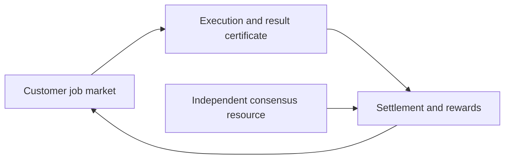

# Technical brief: when proof of work can produce something worth keeping

## The two meanings of useful

Proof of work already has a use: it prices influence in a permissionless system.
The complaint is that its *output* has no value outside that security mechanism.
A proof-of-useful-work proposal tries to sell the same expenditure twice—once to
the blockchain as Sybil resistance and once to a customer who wants storage,
optimization, inference, training, or scientific computation.

That “two for one” is possible only when the two buyers accept the same unit of
work. Consensus needs attempts that are fresh, comparable, difficulty-controlled,
and cheap to verify. A customer needs a particular result on particular data,
usually by a deadline, sometimes privately, and with a quality measure appropriate
to the application. The overlap is narrower than “both use GPUs.”

The security problem can be stated with three costs. Let (C_h) be the honest cost
of producing an eligible result, (C_a) the best adversarial cost, and (V_e) the
external value retained by the producer. Nakamoto-style security depends on the
net cost an attacker must bear, not the gross electricity meter:

\[
  C_{net} = C_a - V_e - S,
\]

where (S) includes private subsidies, pre-existing results, or strategic value
from the external computation. A useful task can reduce society's waste while
also making attacks cheaper. Any serious design must model both effects.

## Why hash puzzles are unusually convenient

A block hash challenge changes with the parent block and transaction commitment.
Attempts expire. The distribution is stable and continuously divisible: more
hashes buy proportionally more chances. A verifier checks one digest. There is no
subjective ranking or customer whose cancellation changes difficulty.

Useful tasks routinely violate these properties. A protein-folding trajectory or
trained model may remain valuable after the block changes. Optimization instances
vary in difficulty and have unknown optima. Training is stochastic. Inference is
easy to redo but its output may be private and the customer may care about latency,
not total arithmetic. A miner can choose unusually easy inputs unless input
generation is constrained; if the protocol chooses inputs, it may have no useful
jobs available at the required rate.

Verification is the most visible difficulty but not the only one. A SNARK can prove
that a computation followed a circuit. It does not prove the input came from a
paying customer, that the model was commercially useful, or that no cheaper
equivalent computation existed. “Verifiable computation” and “useful consensus
work” are distinct constructions.

## Storage is the strongest existing fit

[Permacoin](https://www.cs.umd.edu/~elaine/docs/permacoin.pdf) replaces a pure
scratch-off puzzle with proofs that require random access to pieces of a public
archive. A miner commits storage and uses challenged chunks in its mining attempts.
The retained archive is external output, while local possession helps generate
the consensus proof.

Filecoin develops this idea into two explicit claims. Proof of Replication shows
that a miner created a distinct encoded replica; Proof of Spacetime shows that the
replica remained available over an interval. The [Filecoin specification](https://spec.filecoin.io/)
also reveals the cost of making the abstraction real: sealing pipelines,
commitments, proof aggregation, sector lifecycle, collateral, faults, and separate
retrieval markets.

Storage works better than arbitrary computation because the useful resource
persists and can be sampled. Yet a petabyte of protocol-compliant sealed sectors
is not automatically a petabyte customers want. Data onboarding, retrieval speed,
duplication, geographic placement, legal obligations, and storage duration belong
to a service market. The proof establishes a constrained physical fact, not the
full service quality.

## Optimization produces improvements, not uniform lottery tickets

[Ofelimos](https://eprint.iacr.org/2021/1379.pdf) embeds doubly parallel local
search into a blockchain protocol. Local-search steps can improve solutions to
combinatorial problems while a hash-based selection mechanism retains a lottery.
This is intellectually valuable because it does not claim that any NP-hard answer
is cheaply recognizable as globally optimal.

Its limitation is also fundamental. Useful optimization instances have different
landscapes. A warm start, private heuristic, or previously discovered basin changes
the cost of improvement. Some instances stop yielding value; others have buyers
willing to subsidize particular miners. Normalizing “one unit of useful search”
across instances without making the normalization itself expensive is difficult.

A commercially credible optimization network may therefore use consensus to order
and settle competitions rather than derive all leader election from their search.
Customers can pay for improvements, and validators can verify certificates or
challenge traces. That is useful decentralized computation, even if it is not pure
PoUW.

## Machine learning magnifies every mismatch

Proof-of-learning proposals ask miners to train models and use accuracy,
checkpoints, gradient traces, or replay samples as evidence. Training seems
attractive because it consumes enormous accelerator fleets. It is a poor consensus
primitive for the same reason it is a difficult procurement contract: outcomes
depend on data, initialization, hyperparameters, software versions, nondeterministic
kernels, and the definition of quality.

Accuracy is easy to understand but invites benchmark leakage and overfitting.
Recomputing training defeats the efficiency goal. Sampling checkpoints can miss
fabricated segments. A miner can copy a model or synthesize a plausible trajectory.
The paper on [adversarial examples for proof of learning](https://arxiv.org/abs/2108.09454)
constructs attacks on training-integrity evidence; later
[incentive-secure proof-of-learning work](https://arxiv.org/abs/2404.09005)
shifts part of the guarantee from cryptographic impossibility to rational economic
behavior. That may be useful for a marketplace, but consensus must survive irrational,
strategic, or externally subsidized attackers.

Inference has more deterministic structure. Given a model, input, numerical
format, and execution semantics, the output can be checked or proved. But ordinary
inference is cheap relative to proof generation, and privacy may prevent public
inputs. An optimistic verification system—workers commit results, challengers
recompute, and disputes bisect an execution trace—may be more economical than a
proof for every request. Its latency and collateral requirements must remain
outside the critical block path.

## Matrix multiplication is the sharpest new proposal

Komargodski, Schen, and Weinstein's 2025
[PoUW from arbitrary matrix multiplication](https://eprint.iacr.org/2025/685.pdf)
addresses a subtle permissionless problem: the miner chooses the input, so the
certificate must not let malicious miners select matrices that produce cheap
eligibility. The construction adds randomized algebra around matrix products and
aims for (1+o(1)) overhead relative to naïve multiplication. Its security rests
on a conjectured hardness relation involving batches of random low-rank linear
equations.

This is the most relevant bridge to AI accelerators because dense matrix
multiplication has objective semantics and enormous deployed demand. Three gaps
remain before “AI computation secures the chain” follows.

The first is provenance. If miners choose arbitrary matrices, random products
qualify even when no model needs them. If customers choose matrices, workload
availability and censorship enter leader election. The second is reuse. Training
and inference use structured, batched, quantized products; cached activations,
low-rank structure, sparsity, and repeated weights may change the cheapest path
relative to the assumed operation. The third is numerical semantics. AI kernels
use floating point, integer quantization, stochastic rounding, and fused operations,
whereas cryptographic verification prefers exact fields or integers. Translating
between them may erase the claimed small overhead.

The proposal should be tested, not dismissed. The right experiment uses real model
traces and adversarially chosen matrix families rather than a peak-TFLOPS benchmark.

## A more robust commercial architecture

The near-term design with the best failure behavior has three layers:

Consensus continues when customer demand is zero. Useful jobs earn fees and may
earn protocol incentives, but they do not replace the entire adversarial resource.
Workers can schedule useful and consensus kernels on the same fleet. Result
certificates may be succinct proofs, redundant execution, trusted-hardware
attestation, or optimistic disputes depending on job value and latency.

This architecture gives up the pure claim that all PoW is useful. It gains a
clearer business: a decentralized accelerator or storage market with on-chain
settlement whose security is not hostage to its current order book. Over time,
specific workloads with proven fungibility can contribute more directly to leader
selection.

## Specific experiments and open questions

Build a *usefulness adversary harness*. For each proposed task, generate outputs
that satisfy the computational certificate while minimizing customer value:
random matrices, duplicated storage, memorized benchmark models, stale inference,
low-rank products, and precomputed optimization trajectories. Then reverse the
attack: produce commercially valuable output that receives little or no consensus
credit. The gap between the two is a better measure than the percentage of GPU
cycles labeled useful.

Instrument real inference and training graphs to identify products that are exact,
fresh, externally demanded, and costly enough to matter. Feed those matrices into
the 2025 construction and measure additional kernels, memory traffic, numerical
conversion, proof size, and verification. Test whether batching across customers
creates a shortcut or improves amortization honestly.

For storage, measure retrieval and geographic diversity alongside proof-compliant
capacity. Can a proof incorporate a service-level sample without turning every
block into a latency lottery? Can erasure-coded public datasets produce more
useful redundancy than undifferentiated sealed replicas?

For ML, investigate proof of *incremental contribution* rather than proof of full
training. Can a worker demonstrate that a gradient batch, evaluation, synthetic-data
filter, or model merge improved an agreed artifact without revealing private data?
How are negative or failed experiments valued? These are likely marketplace
questions before they are consensus questions.

Finally, model the attacker's external revenue. If an attacker can train its own
valuable model while reorganizing the chain, how much of the nominal work cost is
recoverable? A PoUW design that ignores this subsidy may be less secure than the
“wasteful” hash system it replaces.
