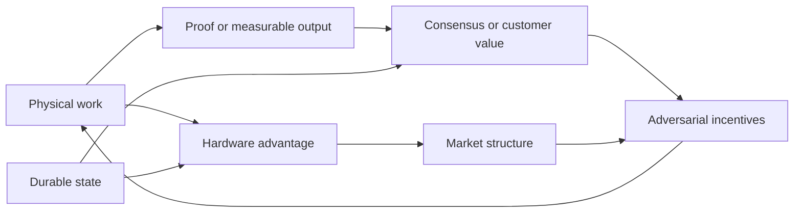

# The Shape of Expensive Computation

## An orientation to proof, memory, inference hardware, and durable personal intelligence

The technologies examined here are not one field. They meet because each asks a
version of the same engineering question: **what physical work should a digital
system make expensive, and what durable result should remain after the expense?**

Bitcoin chooses repeated SHA-256 evaluation. Equihash chooses the construction
and reduction of large collision lists. A post-quantum signature makes forgery
expensive by relying on problems believed to resist both classical and quantum
algorithms. An inference engine spends energy moving parameters and state through
a memory hierarchy. A personal learning system spends computation deciding what
an interaction means and what, if anything, should persist. These mechanisms are
not interchangeable, but they can be studied with a shared appreciation for
physical cost, verification, state, and adversarial incentives.

The commercial question follows immediately. If the expensive operation is tied
to a scarce component—HBM, advanced packaging, a particular interconnect, or a
specialized software stack—then the algorithm helps determine who can enter the
market and who captures its margin. If the retained result has external value,
as in storage or model training, that value may subsidize honest operators. It
may equally subsidize an attacker. If the durable result is personal state, the
format and custody of that state may matter more than which frontier model happens
to read it this year.

This is why the work should not begin from the order of the original questions.
The more revealing structure runs through four boundaries: between computation
and verification; between arithmetic and data movement; between fixed protocol
rules and changing hardware; and between disposable models and durable state.

## Proof is an economic interface

A proof-of-work puzzle is often described as a mathematical problem, but its
protocol role is economic. It converts electricity, equipment, and time into a
publicly checkable lottery ticket. The familiar requirement that a result be hard
to produce and cheap to verify is only the beginning. Mining attempts must be
fungible enough that the network can compare them, unpredictable enough to defeat
precomputation, and parameterized so that difficulty can track changing supply.
The winning proof must bind to the chain state. Honest and adversarial work must
have sufficiently similar cost distributions that a miner cannot win by solving
a cheaper, unintended problem.

Equihash was a particularly thoughtful attempt to change the physical character
of this lottery. Its generalized-birthday search creates large intermediate lists
and repeatedly combines entries whose partial hashes collide. The original
[Equihash paper](https://eprint.iacr.org/2015/946.pdf) argued that steep
time–space trade-offs would make memory reduction punitive and that memory
bandwidth would restrain custom hardware. In practice, the distinction between
the abstract algorithm and its record layout proved decisive. Tromp-style solvers,
the OpenCL [silentarmy implementation](https://github.com/mbevand/silentarmy),
and later adversarial analyses reduced memory traffic through buckets, compact
records, pruning, and recomputation.

The subject is newly active. A 2026 TCHES paper on
[memory optimization of Wagner's algorithm](https://doi.org/10.46586/tches.v2026.i2.218-239)
separates *list-size reduction* from *list-item reduction*. Instead of making the
lists dramatically shorter—which can indeed trigger steep theoretical penalties—it
stores less ancestry per entry and reconstructs it later. Its reported designs
reduce peak memory by more than half in relevant configurations for approximately
a twofold time cost. That does not make Equihash unsound. It does show that the
security-relevant cost is produced by a complete implementation strategy, not by
the nominal list cardinality alone.

This lesson generalizes. “Memory hard” is not a material property like density.
It describes a lower bound, or an empirical approximation to one, under a model of
computation. DRAM capacity, bandwidth, latency, energy, controllers, locality,
compression, and the possibility of recomputing discarded state are different
resources. An algorithm can be capacity-heavy but bandwidth-light, bandwidth-heavy
but regular enough for efficient custom streaming, or latency-sensitive but easy
to parallelize across many outstanding requests. RandomX takes a different route:
its [reference design](https://github.com/tevador/RandomX) uses generated programs,
integer and floating-point operations, branches, a large dataset, and a smaller
scratchpad to imitate a broad CPU workload. It tries to make a specialized miner
rebuild much of a general processor rather than merely attach DRAM to a narrow
hashing pipeline.

The business objective should therefore be stated honestly. Permanent ASIC
resistance is not credible. A useful target may be a bounded specialization
advantage, a longer useful life for commodity equipment, or a mining market whose
capital is not stranded when one chain declines. Each target implies a different
puzzle. Each also creates constituencies: incumbent miners, chip vendors, pool
operators, and protocol developers will value the same optimization differently.

## Useful work creates a second market—and a second attack surface

It is tempting to regard unused mining output as waste waiting to be converted
into model training, simulation, or scientific discovery. The obstacle is not
that useful tasks are hard. It is that their usefulness belongs to an external
market while their security role belongs to the protocol.

Hash attempts are unusually suitable for Nakamoto consensus because their value
is almost entirely internal. They expire when the block changes; one attempt is
easy to compare with another; verification is tiny; and there is no customer who
can privately pay an attacker to perform the same work. Useful tasks behave
differently. Some inputs are more valuable than others. Results may be reusable,
secret, approximate, or expensive to judge. A customer may withdraw a job. A miner
may already possess a result. Two results of equal computational cost may have
radically different commercial value.

Storage is the cleanest partial exception. [Permacoin](https://www.cs.umd.edu/~elaine/docs/permacoin.pdf)
made mining depend on locally accessible pieces of a public archive, while
Filecoin's proof systems make replication and continued storage publicly
checkable. The useful output—retained bytes—resembles the scarce resource being
proved. Even here, sealing cost, retrieval quality, duplicate demand, data
selection, and long-term incentives remain separate from the proof itself.

Optimization and machine learning are harder. Ofelimos constructs consensus
around local search, while proposed proofs of learning use training histories,
model quality, or guided gradients. These approaches face shortcut, verification,
and determinism problems. A model can be copied; a trace can sometimes be forged
or compressed; a benchmark can be overfit; and nondeterministic kernels complicate
agreement. Work on [adversarial examples for proof of learning](https://arxiv.org/abs/2108.09454)
illustrates why a plausible training transcript is not equivalent to proof that
the claimed expensive process occurred.

The 2025 proposal for [proofs of useful work from arbitrary matrix
multiplication](https://eprint.iacr.org/2025/685.pdf) is more precise. It attempts
to bind permissionless PoW to matrices selected by the miner while adding only
small asymptotic overhead to the multiplication. This is cryptographically
interesting because matrix multiplication is both objectively defined and central
to AI. Yet a multiplication can be perfectly verified and economically useless.
The matrices must arise from a real workload, at the right time, with outputs a
customer wants. Proving arithmetic and proving usefulness are different claims.

The commercially plausible architecture may therefore be less romantic than a
pure useful-work chain. Consensus can price a simple adversarial resource, while a
separate job market rewards verified useful results. Shared hardware and scheduling
can couple the markets without making chain safety depend on customer demand. A
stronger construction may eventually merge them, but it must demonstrate that
external value does not create a cheaper path to attacking consensus.

## Quantum computing turns cryptographic agility into a balance-sheet issue

The post-quantum problem is qualitatively more urgent because cryptographic
migration is slow and asset exposure is persistent. Google Quantum AI's March
2026 study, [*Securing Elliptic Curve Cryptocurrencies against Quantum
Vulnerabilities*](https://quantumai.google/static/site-assets/downloads/cryptocurrency-whitepaper.pdf),
reports circuit designs requiring on the order of 1,200 logical qubits for the
256-bit elliptic-curve discrete-log problem—roughly a twentyfold reduction from
some earlier resource estimates. The paper does not announce a machine capable of
the attack. Logical qubits are not physical qubits, and gate depth, error correction,
magic-state production, clock rate, and reliability determine wall-clock attack
cost. The result nevertheless shortens the comfort supplied by old estimates.

Cryptocurrencies are unusually exposed because public keys, commitments, proofs,
and signatures remain available indefinitely. Shor's algorithm attacks the
discrete-log assumptions behind ECDSA, Schnorr, EdDSA, BLS, pairing-based SNARKs,
and several commitment systems. Grover's algorithm affects hash search much less
dramatically: it offers a quadratic query advantage in an idealized model, while
parallel scaling and fault-tolerant circuit costs still matter. Post-quantum PoW
is therefore not the first emergency. Authorization and consensus signatures are.

Replacing ECDSA with a NIST-standardized signature is not a complete migration.
ML-DSA, SLH-DSA, and the developing FN-DSA occupy different points in signature
size, key size, implementation complexity, signing behavior, and resistance to
side channels. Blockchains add costs absent from ordinary PKI: every signature may
be broadcast, stored, executed by constrained virtual machines, and included in
fee markets. Stateful hash signatures can be attractive for validators with
careful operational control and dangerous for consumer wallets that restore old
backups. Lattice signatures are efficient but introduce larger objects, new
implementation risks, and assumptions that diversified deployments may not want
to share universally.

Ethereum's response shows the actual scope. Its [post-quantum research
program](https://pq.ethereum.org/) treats validator signatures, transaction
authorization, signature aggregation, data commitments, and proof systems as
related migration tracks. Hash-based validator signatures are paired with proof
aggregation because replacing compact BLS aggregation naively would overwhelm
bandwidth. Account abstraction can provide signature agility to users before a
single mandatory transition. Bitcoin has a different topology: exposed UTXOs,
Taproot keys, live mempool races, conservative scripting, and the treatment of
dormant coins make governance part of the security design.

Zero knowledge requires still more care. A proof system is not post-quantum merely
because its headline protocol is called a STARK. Hash parameters, Merkle trees,
Fiat–Shamir, polynomial commitments, recursion layers, and any final elliptic-curve
wrapper all contribute assumptions. The [post-quantum security of
Fiat–Shamir](https://eprint.iacr.org/2017/398.pdf) requires stronger conditions
than the classical folklore transformation. A chain must analyze the deployed
composition, not the family name.

For investors and operators, the immediate asset is cryptographic agility:
inventorying long-lived keys, measuring signature and proof substitution costs,
supporting hybrid authorization, and creating migration mechanisms before they
are emergencies. A chain unable to coordinate a transition carries a governance
discount even if excellent primitives are available.

## Inference is becoming a memory systems business

The dominant Transformer stack appears compute-intensive because vendors advertise
tensor throughput. At interactive batch sizes, autoregressive decoding often
spends much of its time moving weights and key–value state rather than multiplying
them. The same model has two materially different workloads. Prefill processes
many input tokens in parallel and can use large matrix multiplications. Decode
produces one or a few tokens per sequence and repeatedly streams parameters and
growing state. This distinction is already causing systems to disaggregate the
two phases.

[FlashAttention](https://arxiv.org/abs/2205.14135) demonstrated that an exact
algorithm with better tiling can outperform nominally cheaper approximations by
reducing HBM traffic. [PagedAttention](https://arxiv.org/abs/2309.06180) treated
KV allocation as virtual-memory management and raised serving throughput by
reducing fragmentation and enabling sharing. These are not cosmetic kernel
optimizations. They show that the operational algorithm includes allocation,
layout, scheduling, and movement between memory tiers.

Current accelerators reinforce this direction. NVIDIA Blackwell combines low-bit
tensor engines, HBM, chip-to-chip links, NVLink switching, and a tightly integrated
software stack; AMD MI300X offers very large HBM capacity through a chiplet package.
Processing-in-memory proposals such as [Pimba](https://arxiv.org/abs/2507.10178)
move selected Transformer and state-space operations toward HBM banks. The
competitive unit is no longer a chip in isolation. It is the compiler, runtime,
interconnect, memory capacity, scheduling policy, and deployed model architecture.

This opens a design space beyond making dense attention slightly cheaper. Mamba's
[selective state spaces](https://arxiv.org/abs/2312.00752) replace a growing KV
history with recurrent state for many operations. Hyena uses long convolutions and
gating. Gated linear attention exposes recurrent inference forms. Sparse attention
and retrieval can avoid reading most historical tokens. Mixture-of-experts avoids
executing all parameters, although on edge devices the total expert footprint may
still dominate bandwidth and erase the nominal active-parameter advantage.

Numerical representation should likewise be chosen per data role. The
[OCP Microscaling specification](https://www.opencompute.org/documents/ocp-microscaling-formats-mx-v1-0-spec-final-pdf)
shares scales across small blocks, retaining range while shrinking individual
values. Microsoft's [BitNet b1.58 2B4T](https://arxiv.org/abs/2504.12285) shows a
model trained from scratch with ternary weights and 8-bit activations at meaningful,
though not frontier, scale. Ternary weights turn many multiplications into add,
subtract, or skip operations; they do not remove activation scaling, accumulation,
normalization, attention, or memory-access cost.

A plausible post-Transformer machine will therefore be heterogeneous. Small,
frequently updated recurrent state belongs in local SRAM. Hot experts and local
attention windows belong in HBM. Cold semantic or episodic memory belongs in
capacity-oriented memory and storage. Ternary or four-bit weights can use simple
datapaths, while activation outliers and reductions retain wider accumulators.
Log representations may be effective inside positive multiplicative paths but are
poor universal replacements because signed addition becomes expensive. The useful
research object is a compiled block format and execution graph spanning tiers, not
a crusade for one number format.

## Durable personalization should outlive the model

The fastest-changing component of an AI assistant is its base model. The
slowest-changing component is the person. A personalization system that stores
its principal value in a model's weights has this relationship backward.

Retrieval-augmented generation addresses part of the problem but usually treats
memory as passages. Decades of interaction contain events, corrections, repeated
preferences, tentative inferences, obligations, people, projects, and changes of
mind. A vector index can locate semantically similar text; it does not by itself
represent which assertion superseded another, whether the user confirmed it, or
which evidence licensed an inference.

[MemGPT](https://arxiv.org/abs/2310.08560) frames long context as virtual memory,
allowing a model to move information among tiers. [LongMemEval](https://arxiv.org/abs/2410.10813)
shows that extraction, temporal reasoning, updates, multi-session synthesis, and
abstention fail differently. The [Graphiti/Zep temporal graph](https://arxiv.org/abs/2501.13956)
adds temporal relations and changing facts. These systems point toward a durable
personal substrate, but the deeper opportunity is a *memory compiler*: software
that converts observations into typed, provenance-bearing state and then compiles
the relevant portion into context, tool calls, policies, or a small adapter for
whatever base model is current.

Such a substrate should retain raw evidence separately from interpretation.
Assertions need valid-time and transaction-time semantics: when the fact applied
in the world and when the system learned or revised it. Preferences should be
conditional functions, not strings—“prefers concise answers” may depend on topic,
stakes, device, or current task. Procedures should be executable or testable.
Corrections should invalidate derived state selectively. Model-generated
inferences should carry confidence and ancestry rather than silently becoming
biography.

Fine-tuning remains useful for stable behavior that retrieval cannot reliably
induce, but adapters should be treated as compiled caches. When the base model
changes, the durable evidence and personal evaluation suite should regenerate or
select a new adapter. Model editing systems such as
[MEMIT](https://memit.baulab.info/) demonstrate that factual associations can be
altered in weights, yet those edits are architecture-specific and difficult to
audit over decades. Durable state should be portable, inspectable, locally
encryptable, and testable against new models.

The business opportunity is not simply a larger memory database. It is a control
plane for continuity across model vendors. A credible product would own the schema,
provenance, evaluation, migration, and permission system while allowing models to
be replaced. This creates a more defensible asset than prompt history and a more
trustworthy one than opaque behavioral tuning.

## Where the topics genuinely intersect

The strongest connection is memory hierarchy. Equihash exposes how record layout
and recomputation alter a supposedly memory-bound algorithm. Inference systems
show how paging, tiling, compression, and recurrent state reshape the same physical
costs. Personal memory introduces a much slower hierarchy in which archival state
is compiled into a small active working set. These fields can share measurement
methods and data-structure ideas without sharing security claims.

The second connection is verification. Post-quantum proofs, useful work, and
personal memory all need to distinguish an expensive process from a trustworthy
result. Cryptography can prove arithmetic or possession; it cannot decide whether
a model is valuable or whether an inferred personal fact is appropriate. Those
semantic judgments require markets, tests, policies, or human confirmation.

The third connection is hardware optionality. A PoW aimed at inference processors
could create residual demand for accelerators and broaden mining participation.
It could also hand consensus to owners of scarce HBM and proprietary compilers.
An architecture using ternary weights and hierarchical state could reduce inference
cost, but only if training produces competitive models and software exposes the
hardware efficiently. In both cases, benchmark speed is subordinate to the supply
chain and deployability of the full system.

## Open-ended continuations

The most productive continuation is not to select a grand unified algorithm. It
is to build a few instruments that make claims falsifiable.

For memory-hard work, implement the 2026 list-item-reduction solver beside a
Tromp-style baseline and capture not just solutions per second but bytes moved,
record lifetimes, cache misses, peak live ancestry, energy, and recomputation.
Feed the traces into a simple ASIC cost model with SRAM, HBM, LPDDR, and interconnect
assumptions. This would show whether a proposed change buys genuine capital-cost
symmetry or merely shifts advantage between memory technologies.

For post-quantum systems, construct a transaction-and-consensus trace replayer.
Substitute ML-DSA, SLH-DSA, FN-DSA candidates, XMSS variants, and proof-aggregated
signatures into real block distributions. Measure propagation, verification,
storage, state growth, wallet behavior, and reorganization exposure. Separately
build an assumption graph for each deployed ZK stack, including recursive wrappers.
The result should be a migration bill of materials rather than a signature benchmark.

For useful work, require every proposal to expose two independent certificates:
one for computational expenditure and one for customer usefulness. Attempt to
construct cases where either certificate passes while the other fails. Matrix
multiplication should be tested with real inference traces, cached products, low-rank
inputs, batching, and miner-chosen inputs. The important result may be a precise
boundary showing which workloads cannot safely carry consensus.

For hardware-native models, define a block intermediate representation containing
layout, shared scale, sparsity, routing, state-update, and outlier metadata. Compile
the same block to CUDA/Triton, CPU SIMD, FPGA, and a cycle-level toy accelerator.
Compare dense attention, local-attention/recurrent hybrids, and ternary variants on
quality per joule and quality per dollar of memory—not only tokens per second.

For personal learning, create a longitudinal “model succession” benchmark. Feed
years of synthetic but causally structured events into one model generation,
replace the model several times, and test whether permissions, corrections,
conditional preferences, procedures, and calibrated uncertainty survive. Existing
benchmarks mostly ask whether an answer can be retrieved; the commercially decisive
question is whether a person’s accumulated working relationship can migrate without
quietly changing meaning.

These experiments are specific enough to produce evidence and open enough to
change the eventual research program. The accompanying briefs develop each domain
farther and identify the technical questions on which a serious investment or
prototype decision should turn.
